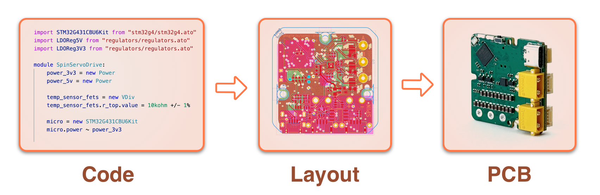

<h1 align="center">
    <picture>
    <source media="(prefers-color-scheme: dark)" srcset="https://github.com/atopile/atopile/assets/9785003/00f19584-18a2-4b5f-9ce4-1248798974dd">
    <source media="(prefers-color-scheme: light)" src="https://github.com/atopile/atopile/assets/9785003/d38941c1-d7c1-42e6-9b94-a62a0996bc19">
    
    </picture>
</h1>

<div align="center">
    <a href="#">
        
    </a>
    <a href="#">
        
    </a>
    <a href="#">
        
    </a>
</div>
<h1 align="center">
    <br>
        
    <br>
</h1>

## 📖 What Is `atopile`?
`atopile` is a tool to build electronic circuit boards with code.

## 🗣️ Join Us On Discord
What's your story in electronics? What would you like us to build? Come talk on discord.

[](https://discord.gg/nr5V3QRUd3)

## ⚡️`ato` Code Examples

### Simple Examples:

#### Voltage Divider
```python
from "generics/resistors.ato" import Resistor

module VoltageDivider:
    signal top
    signal out
    signal bottom

    r_top = new Resistor
    r_top.footprint = "R0402"
    r_top.value = 100kohm +/- 10%

    r_bottom = new Resistor
    r_bottom.footprint = "R0402"
    r_bottom.value = 200kohm +/- 10%

    top ~ r_top.p1; r_top.p2 ~ out
    out ~ r_bottom.p1; r_bottom.p2 ~ bottom
```

#### RP2040 Blinky Circuit
```python
import RP2040Kit from "rp2040/rp2040_kit.ato"
import LEDIndicator from "generics/leds.ato"
import LDOReg3V3 from "regulators/regulators.ato"
import USBCConn from "usb-connectors/usb-connectors.ato"

module Blinky:
    micro_controller = new RP2040Kit
    led_indicator = new LEDIndicator
    voltage_regulator = new LDOReg3V3
    usb_c_connector = new USBCConn

    usb_c_connector.power ~ voltage_regulator.power_in
    voltage_regulator.power_out ~ micro_controller.power
    micro_controller.gpio13 ~ led_indicator.input
    micro_controller.power.gnd ~ led_indicator.gnd

    led_indicator.resistor.value = 100ohm +/- 10%
```

### Full Projects

Checkout out the [servo drive project](https://github.com/atopile/spin-servo-drive) or the [logic card project](https://github.com/timot05/logic-card).

## 🔨 Getting Started

Find our [documentation](https://atopile.io/getting-started/) and getting started [video](https://www.youtube.com/watch?v=7aeZLlA_VYA).

`atopile` is on pypi.org: https://pypi.org/project/atopile/

### Most Basic Installation

`atopile` requires *python3.11* or later, which you can install using your package manager or from [python.org](https://www.python.org/downloads/).

Then just `pip install atopile` and you're good to go!

## ❓ Why Atopile?

The objective of atopile is to help push forward these pardiagrams from the software world to hardware, mainly these points:

* **Intelligent Design Capture**: Define hardware specifications like ratios and tolerances in code, enabling precise control and easy reuse of designs.
* **Version Control Integration**: Use git to manage design changes, facilitating collaboration and ensuring each iteration is thoroughly reviewed and validated.
* **Continuous Integration (CI)**: Implement CI to guarantee high-quality, compliant designs with every commit, represented by a green checkmark for assurance.

Describing hardware with code might seem odd at first glance. But once you realize it introduces software development paradigms and toolchains to hardware design, you'll be hooked, just like we've become.

Code can **capture the intelligence** you put into your work. Imagine configuring not the resistance values of a voltage divider, but its ratio and total resistance, all using **physical units** and **tolerances**. You can do this because someone before you described precisely what this module is and described the relationships between the values of the components and the function you care about. Now instead imagine what you can gain from **reusing** a buck design you can merely **configure** the target voltage and ripple of. Now imagine **installing** a [servo drive](https://github.com/atopile/spin-servo-drive) the same way you might numpy.

Version controlling your designs using **git** means you can deeply **validate** and **review** changes a feature at a time, **isolated** from impacting others' work. It means you can detangle your organisation and **collaborate** on an unprecedented scale. We can forgo half-baked "releases" in favor of stamping a simple git-hash on our prototypes, providing an anchor off which to **associate test data** and expectations.

Implementing CI to **test** our work ensures both **high-quality** and **compliance**, all summarised in a green check mark, emboldening teams to target excellence.

## 🔍 Discover what people build

Browse and submit your modules at [packages.atopile.io](https://packages.atopile.io)
