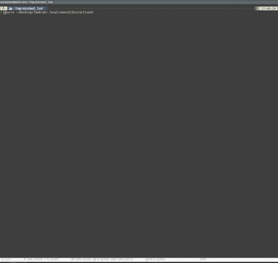

<div align="center">

# faebryk

### \[fˈɛbɹɪk\]

<a href="https://github.com/atopile/faebryk">

</a>
<br/>

Open-source software-defined EDA tool

[](https://github.com/atopile/faebryk/releases/latest) [](https://github.com/atopile/faebryk/blob/main/LICENSE) [](https://github.com/atopile/faebryk/pulls) [](https://github.com/atopile/faebryk/issues)
[](https://discord.com/channels/1022538123915300865) [](https://pypi.org/project/faebryk/) [](https://github.com/atopile/faebryk/commits/main)

[](https://github.com/psf/black)

</div>

In short faebryk is a python library that allows you to design ready-to-order electronics (PCBs, schematics, etc) in code. It aims to reduce the entry-barrier for hardware design by bridging the gap between software and hardware design.

---


## Using faebryk

```bash
> pip install faebryk
```


```python
import faebryk.library._F as F
from faebryk.core.module import Module
from faebryk.libs.brightness import TypicalLuminousIntensity
from faebryk.libs.examples.buildutil import apply_design_to_pcb

class App(Module):
    led : F.PoweredLED
    battery : F.Battery

    def __preinit__(self) -> None:
        self.led.power.connect(self.battery.power)

        # Parametrize
        self.led.led.color.constrain_subset(F.LED.Color.YELLOW)
        self.led.led.brightness.constrain_subset(
            TypicalLuminousIntensity.APPLICATION_LED_INDICATOR_INSIDE.value
        )


apply_design_to_pcb(App())
```

<div align="center">



</div>

## Get stared with your own project
```bash
> pip install faebryk
> faebryk project <name> local

# if that doesn't work because faebryk is not in your PATH
> python -m faebryk project <name> local
```

For more details checkout the [project template](https://github.com/faebryk/project-template).

---

## About

### What \[is faebryk\]

faebryk is an open-source software-defined electronic design automation (EDA) tool.
Think of it like the evolution from EDA tools like KiCAD, Altium, Eagle...
in the way those were the next step from designing electronic circuits on paper.
The main idea of faebryk is to **describe your product on the highest level** possible and then iteratively refining the description to arrive on a complete and detailed implementation.
In comparison to classic EDA and design tools which use GUIs, faebryk uses code (Python) to create designs.
While the main focus is on the EDA part currently, faebryk aims to become a holistic system design tool.

### How \[does designing with faebryk work\]

faebryk itself is just a **python library** that you include in your project. It is providing you with all the tools to describe and design your system and to export that design into something useful like for example a netlist, a devicetree, gerbers etc, which you then can use in the next steps of your project. Key concepts of faebryk are the graph, importers, exporters, the library and the user application.
To understand how to use faebryk in your project see [using faebryk](#using-faebryk).

### Who \[is faebryk\]

faebryk is a community driven project. That means faebryk does not only consist out of core developers but also users, external contributors, moderators and you! It is founded by a group of embedded, electrical, product design and software engineers with a love for making.

### Why \[do we make faebryk\]

We noticed that the innovations of software engineering that make fast, scalable, robust solutions possible have not found their way into hardware design. Furthermore there is a lot of duplicate work done. Think of determining the pinout of a SoC and then having to translate that exact pinout into software again or having to constantly adapt designs for supply chain issues.
Additionally, hardware design has quite a big barrier of entry for makers, but we don't think it has to.
Currently hardware design is also quite labor intensive with very little automation.
faebryk aims to tackle all those issues and also opens up some exciting possibilities, such as benefiting from the version management and collaboration tools that are used in modern software development.

### When \[is faebryk being developed\]

faebryk is being continuously developed.
The core team focuses on core functionality and features of faebryk, as well as the general direction of the project.
The strength of the community can really shine with the development of importers, exporters, libraries, and projects, but everyone is welcome to [help](#community-support) out where they can.

### Where \[do we develop faebryk\]

faebryk is being developed completely in the open on Github.
All the information you need to start using and contributing to faebryk will be in or linked to from [this repository](https://github.com/atopile/faebryk).
If you have any questions you can ask them on our [Discord](https://discord.gg/nr5V3QRUd3).
For pull requests and bug-reports, see our [contributing guidelines](docs/CONTRIBUTING.md).

---

## Development

### Installing from source
Setup

```bash
> git clone https://github.com/atopile/faebryk.git
> cd faebryk
>
> poetry install
```

Running examples

```bash
> poetry shell
> python ./examples/<sample_name>.py
```

### Versioning

faebryk uses [semantic versioning](https://semver.org/) in the [releases](https://github.com/atopile/faebryk/releases).

As feabryk is still in the early stages of development new releases will have a lot of (breaking) changes in them.
Our [roadmap](#versioning)(TODO) will show you where the project is going to and what you can expect in future releases.

### Contributing

See [CONTRIBUTING.md](docs/CONTRIBUTING.md)

To get inspiration on things to work on check out the issues.

#### Running your own examples/Making samples

First follow the steps in get running from source.
Then add a file in examples/ (you can use one of the examples as template).
Call your file with `python3 examples/<yourfile>.py`.

#### Running tests

Run

```bash
> pytest test
```

## Community Support

Community support is provided via Discord; see the Resources below for details.

### Resources

- Source Code: <https://github.com/atopile/faebryk>
- Chat: Real-time chat happens in atopile's Discord Server. Use this Discord [Invite](https://discord.gg/nr5V3QRUd3) to register
- Issues: <https://github.com/atopile/faebryk/issues>
