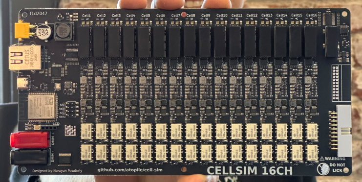
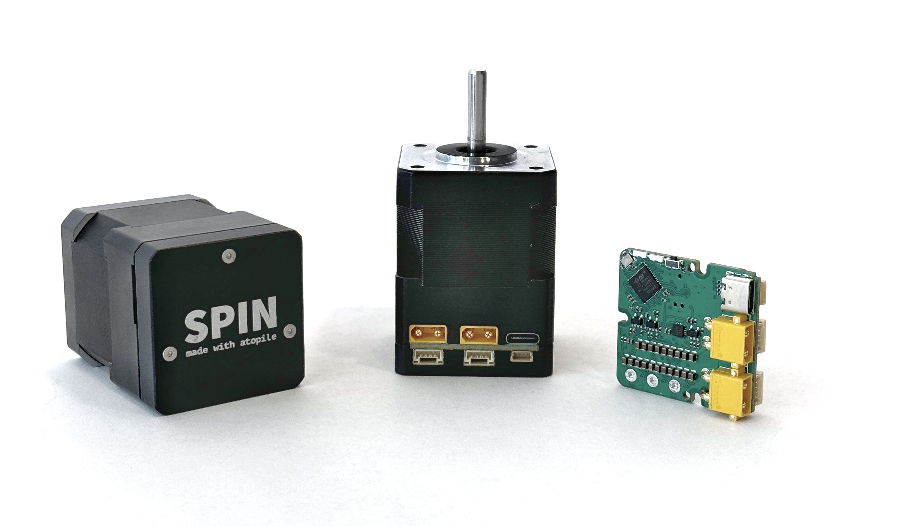

<h1 align="center">
    <picture>
    <source media="(prefers-color-scheme: dark)" srcset="https://github.com/atopile/atopile/assets/9785003/00f19584-18a2-4b5f-9ce4-1248798974dd">
    <source media="(prefers-color-scheme: light)" src="https://github.com/atopile/atopile/assets/9785003/d38941c1-d7c1-42e6-9b94-a62a0996bc19">
    
    </picture>
</h1>

# Welcome

`atopile` is a language, compiler and toolchain to design electronics with code.

Design circuit boards with the same powerful workflows that software developers use - version control, modularity, and automated validation. Instead of point-and-click schematics, use human-readable `.ato` files that can be version controlled and shared. Capture design intelligence and validation rules in code to ensure your hardware works as intended.

## Features

- 🚀 Auto-select components like resistors and capacitors, based on their attribute's values
- 🤖 Embed calculations in your code, which are checked on every build
- 🧱 Build you circuit from reliable configurable modules so you can focus on high level design
- 💥 Build, release and test your circuit board from the `CLI`
- 📦 Embedded package manager to install and manage modules from https://packages.atopile.io, or Github
- 🔍 Version control line-by-line diffable code w/ git

Jump right in with the [quickstart guide](https://docs.atopile.io/quickstart)

## Who's atopile for?

Currently atopile is young - which means we can't do everything yet and we're focussed on being incredible at a few things:

### Custom Validation Equipment

> "Rome wasn't built in a day, but your HiL should be"

If you're serious about automating the validation of your production hardware, you're in the right place.

[Cell-sim](https://github.com/atopile/cell-sim/) is a 16ch, 16-bit, isolated, 0-5V, 0-500mA battery-cell simulator designed from scratch in atopile, from concept to 2-revisions in under 5 days work. Oh, and that time includes the firmware. It is a relatively complex HiL design, and required many new modules that didn't yet exist on our package manager. Simpler HiL designs are frequently just a day's work.

### Young companies who need to iterate on hardware

`atopile` designed hardware is in satellites, humanoid robots and VTOL drones - all from startups within the last year.

Not every young company NEEDs to iterate on it's hardware, but many more should than do.

We're used to this in the software world, but getting the same engine running at even remotely similar speeds for hardware is a huge challenge. `atopile` let's multiple people work on different features or concepts on the same project in parallel via branches in `git`. With calculations checked and tests run automatically on every change, you can iterate as an individual - quickly trying out new ideas before committing to a design as a team and only after validating it in the real-world.

### Huge nerds 🤓

Welcome the club!

If you like making dope stuff, like these [servo drives](https://github.com/atopile/spin-servo-drive) you're in the right place. Welcome!

## ❓ Why Atopile?

The objective of atopile is to help push forward paradigms from the software world to hardware design. Describing hardware with code might seem odd at first glance. But once you realize it introduces software development paradigms and toolchains, you'll be hooked, just like we've become.

**Intelligent Design Capture**: Code can capture the intelligence you put into your work. Define hardware specifications like ratios and tolerances in code, enabling precise control and easy reuse of designs. Imagine configuring not the resistance values of a voltage divider, but its ratio and total resistance, all using physical units and tolerances. You can do this because someone before you described precisely what this module is and described the relationships between the values of the components and the function you care about. Now instead imagine what you can gain from reusing a buck design you can merely configure the target voltage and ripple of. Now imagine installing a [servo drive](https://github.com/atopile/spin-servo-drive) the same way you might numpy.

**Version Control Integration**: Use git to manage design changes, facilitating collaboration and ensuring each iteration is thoroughly reviewed and validated. Version controlling your designs using git means you can deeply validate and review changes a feature at a time, isolated from impacting others' work. It means you can detangle your organisation and collaborate on an unprecedented scale. We can forgo half-baked "releases" in favor of stamping a simple git-hash on our prototypes, providing an anchor off which to associate test data and expectations.

**Continuous Integration (CI)**: Implement CI to guarantee high-quality, compliant designs with every commit, represented by a green checkmark for assurance. Implementing CI to test our work ensures both high-quality and compliance, all summarised in a green check mark, emboldening teams to target excellence.

## 🔍 Discover what people build

Browse and submit your modules at [packages.atopile.io](https://packages.atopile.io)
