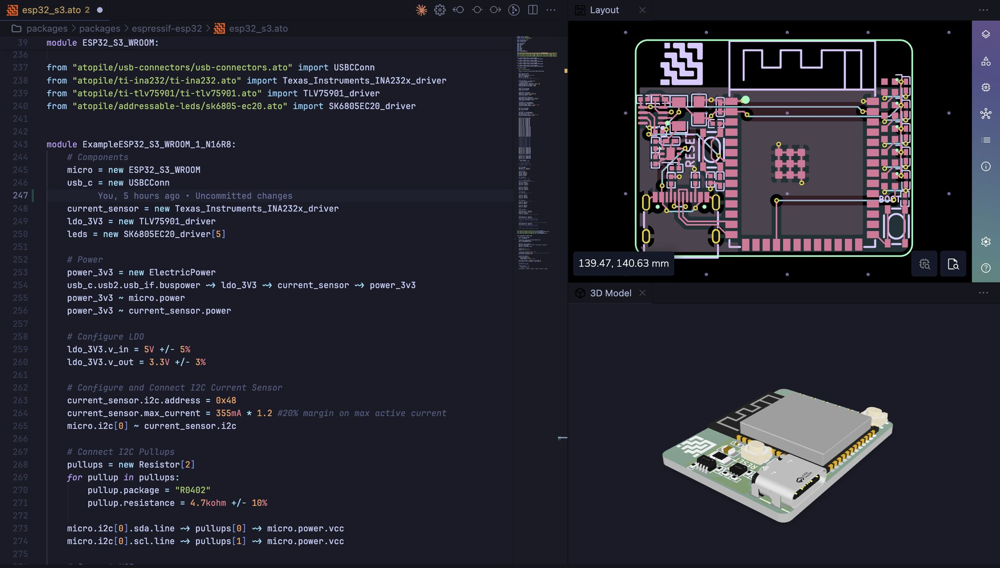

<h1 align="center">
    <picture>
    <source media="(prefers-color-scheme: dark)" srcset="https://github.com/atopile/atopile/assets/9785003/00f19584-18a2-4b5f-9ce4-1248798974dd">
    <source media="(prefers-color-scheme: light)" src="https://github.com/atopile/atopile/assets/9785003/d38941c1-d7c1-42e6-9b94-a62a0996bc19">
    
    </picture>
</h1>

<p align="center">
  <a href="https://pypi.org/project/atopile/"></a>
  <a href="https://docs.atopile.io/"></a>
  <a href="https://packages.atopile.io/"></a>
  <a href="https://discord.gg/CRe5xaDBr3"></a>
  <a href="LICENSE"></a>
</p>

## Design circuit boards with code

Write hardware like software. atopile is a language, compiler, and toolchain for electronics—declarative `.ato` files, deep validation, and layout that works natively with KiCad.

<p align="center">
  
</p>

## Why atopile

- Reusable modules instead of starting from scratch every time
- Capture intent with equations directly in your design
- Automatic parametric picking of discrete components

### A tiny taste of `ato`

```ato
import ElectricPower
from "atopile/ti-tps54560x/ti-tps54560x.ato" import TPS54560x

module App:
    # Interfaces
    power_24v = new ElectricPower
    power_5v = new ElectricPower

    # Components
    regulator = new TPS54560x

    # Configure
    assert power_24v.voltage within 24V +/- 3%
    assert power_5v.voltage within 5V +/- 3%

    # Connections
    power_24v ~> regulator ~> power_5v
```

More examples: https://docs.atopile.io/quickstart

## Install

The easiest way is via the editor extension—it installs and manages `ato` for you:

- VS Code/Cursor extension: https://marketplace.visualstudio.com/items?itemName=atopile.atopile

Advanced setups and CLI installs: https://docs.atopile.io/guides/install

## Quickstart (2 minutes)

1. Install the extension (link above)

2. In the editor, run “atopile: Open Example” and pick one

3. Press the ▶ in the ato menu bar to build, or run `ato build` from the terminal

4. Open layout when ready

Notes:

- The ato menu bar is in the bottom-left of your VS Code/Cursor window
- KiCad is optional to get started. Without it, you won’t open the PCB, but builds still run and update the `.kicad_pcb`. Install later when you’re ready for layout: https://docs.atopile.io/quickstart

## How it works

- `ato` is a declarative language for electronics: modules, interfaces, units, tolerances, and assertions
- The compiler solves constraints, picks parts, runs checks, and updates your KiCad layout
- The extension adds language services and one‑click controls
  Learn more: https://docs.atopile.io/atopile/essentials/1-the-ato-language

### Where atopile fits in

High-level steps:

- Requirements — capture specs with units, tolerances, and assertions
- Component selection — parametric picking, reuse proven modules
- Design capture — `.ato` modules and interfaces compose your system
- Layout — place and route in KiCad
- Checks — run design checks locally or in CI
- Build outputs — BOM, fabrication and assembly data, reports
- PCB fab/assembly — send outputs to your manufacturer


## Examples

- Quickstart walkthrough: https://docs.atopile.io/quickstart
- Open examples via the editor (“atopile: Open Example”)
- Repository examples: `examples/`

## Packages and parts

- Browse and install modules from the registry: https://packages.atopile.io
- Guide: https://docs.atopile.io/essentials/4-packages
- Publish your own: https://docs.atopile.io/guides/publish

## Compatibility

- OS: macOS, Linux, Windows (WSL recommended)
- Editors: VS Code / Cursor
- EDA: KiCad recommended for layout; not required to start

## Contributing and development

- Development setup: https://docs.atopile.io/guides/development
- Editable install (for working on atopile itself): https://docs.atopile.io/guides/install#editable-installation-best-for-development
- Run tests:

```sh
pytest -q
```

- Issues and feature requests: https://github.com/atopile/atopile/issues

## Support

- Discord “help” channel: https://discord.gg/CRe5xaDBr3
- Commercial support: hi@atopile.io

## License

MIT. See `LICENSE`.
