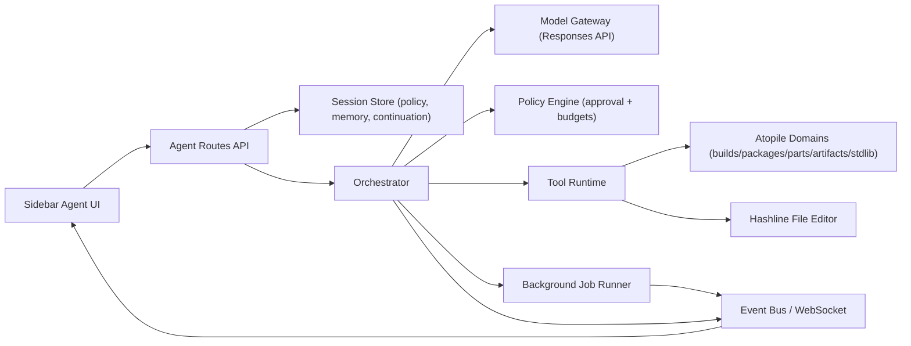

# Codex Architecture Review for Atopile Agent

As of February 12, 2026.

## Executive summary

Codex works well because it combines:

1. Strong execution control (approvals, sandboxing, scoped actions).
2. Tool-first orchestration with structured contracts.
3. Streaming + background task execution for long-running work.
4. Persistent instruction and workflow layering (AGENTS + skills).
5. Clean task isolation (worktrees/branches) and review-first UX.

For atopile, the highest-value architectural move is to keep your strict domain-tool approach (no generic shell), then add Codex-style execution control, resumable/background runs, and richer state management around tools and sessions.

---

## What Codex patterns are worth copying

## 1) Controlled execution runtime

Codex exposes explicit approval modes and records commands/tool actions in a transcript. This creates predictable behavior and auditability.

Implication for atopile:
- Add explicit execution policy per session: `ask`, `auto-safe`, `auto`.
- Gate risky tools (file edits, install, build run) by policy rather than prompt-only instruction.
- Keep a first-class action log as part of session state, not only UI traces.

## 2) Structured tool use over free-form command use

Codex and the Responses API emphasize explicit tool schemas, deterministic function calling, and passing tool outputs back into the loop.

Implication for atopile:
- Keep the current tool-only direction.
- Strengthen with strict schema validation and typed error categories (`validation_error`, `policy_denied`, `transient_backend_error`, `stale_anchor`, `timeout`).
- Favor composite domain tools for common workflows (for example: explain build failure, module health check).

## 3) Session state and context management

Codex patterns rely on persistent conversation state and continuation IDs instead of fully replaying everything every turn.

Implication for atopile:
- Persist model response continuity across turns (session-level continuation pointer).
- Keep compact working memory: selected targets, recent tool results, latest build IDs/status, and stale markers.
- Add explicit context compaction/summarization when turns get long.

## 4) Streaming and background execution

Codex supports live progress and background execution for long tasks.

Implication for atopile:
- You already stream tool start/end; add assistant text token streaming.
- Introduce background job mode for long build/manufacturing/diagnostic runs with resumable status in sidebar.

## 5) Instruction layering via AGENTS and skills

Codex uses repository instructions plus reusable skill packs.

Implication for atopile:
- Keep AGENTS.md as policy/instruction source.
- Add "atopile skills" as reusable tool workflows (for example: `diagnose_build`, `select_part`, `review_manufacturing_readiness`) with short contracts and expected outputs.

## 6) Task isolation and review workflow

Codex app emphasizes isolated task execution and clean diffs.

Implication for atopile:
- For larger edits, run in isolated git worktree or feature branch per agent task.
- Surface "proposed changes" review card before apply/merge to active branch.

---

## Current atopile state vs Codex patterns

Already strong:
- Hashline edit harness with stale-anchor remaps.
- Tool manifest/suggestions/memory mediator.
- Live tool progress events in UI.
- Expanded domain tools (builds/logs/reports/stdlib/diagnostics).
- Higher tool-loop budget for multi-step execution.

Main architecture gaps:
- No explicit approval policy engine.
- No persisted/resumable model continuation across turns.
- No background task runner for long agent jobs.
- No token-level assistant streaming.
- Tool contracts are function schemas, but not yet strict typed envelopes end-to-end.
- No isolated task worktree/branch workflow.

---

## What to implement next (priority order)

## P0: Execution control and reliability

1. Add `AgentExecutionPolicy` to session state.
   - Modes: `ask`, `auto_safe`, `auto`.
   - Tool categories annotated as `safe` or `requires_approval`.
2. Standardize tool result envelope.
   - `{ ok, code, message, data, retryable, hint }`
3. Add orchestrator retry policy for model/tool transport failures.
   - Bounded exponential backoff for `429`/`5xx`.
4. Add hard per-turn budgets.
   - Max tool calls, max wall time, per-tool timeout, max repeated same-tool pattern.

## P1: Stateful/resumable agent runtime

1. Persist session continuity metadata.
   - Store latest model continuation ID per session.
2. Add context compaction.
   - Summarize old turns/tool traces into compact memory entries.
3. Add background runs.
   - New route for async agent tasks.
   - Poll/subscribe for status.
   - Resume in sidebar after reload.
4. Stream assistant text deltas.
   - Keep current tool progress events and add textual delta events.

## P1: Codex-like domain workflows (skills)

1. Add skill registry for deterministic composite flows:
   - `diagnose_build_failure`
   - `install_part_and_validate`
   - `manufacturing_readiness_review`
2. Skills define:
   - entry criteria
   - ordered tool steps
   - expected structured output schema
3. UI: one-click skill suggestions from current context.

## P2: Task isolation and review UX

1. Optional isolated worktree per agent task.
2. Branch/diff summary card in sidebar before applying changes.
3. Optional "best-of-N" proposal mode for risky refactors (generate N plans, choose one).

---

## Proposed target architecture

---

## Implementation notes specific to atopile

1. Do not add generic shell tools to sidebar agent.
2. Keep file access scoped to project root and allowed extensions.
3. Prefer composite domain tools over prompt-only "reasoning chains."
4. Keep build/manufacturing operations asynchronous by default once background mode exists.
5. Treat stdlib/lsp/project graph as first-class context tools, not passive prompt text.

---

## Suggested milestones

1. Milestone A (1 week): policy engine + standardized tool envelope + retries.
2. Milestone B (1 week): continuation persistence + context compaction.
3. Milestone C (1-2 weeks): background agent jobs + resume + text streaming.
4. Milestone D (1-2 weeks): skill registry + isolated task worktree UX.

---

## Source references

- [Codex CLI docs](https://developers.openai.com/codex/cli/)
- [Codex cloud docs](https://developers.openai.com/codex/cloud/)
- [Codex overview](https://platform.openai.com/docs/codex/overview)
- [OpenAI tool calling guide (Responses API)](https://platform.openai.com/docs/guides/tools?api-mode=responses)
- [OpenAI function calling guide](https://platform.openai.com/docs/guides/function-calling)
- [OpenAI reasoning best practices](https://platform.openai.com/docs/guides/reasoning/best-practices)
- [OpenAI conversation state guide](https://platform.openai.com/docs/guides/conversation-state?api-mode=responses)
- [OpenAI background mode guide](https://platform.openai.com/docs/guides/background)
- [Using Codex with your ChatGPT plan (Help Center)](https://help.openai.com/en/articles/11369540-codex-in-chatgpt)
