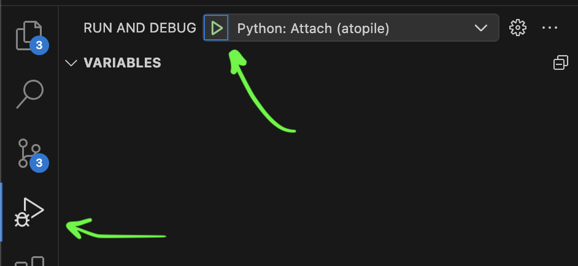

# Development

## Prerequisites

- [Editable atopile install](/guides/installation/#editable-installation-best-for-development)

## Dev Tools

We recommend VSCode for development. If nothing else, it has heaps of high quality extensions and atopile language support, plus it's what we all use internally - so we know how to configure it for purpose.

You should have at minimum:
- [Cursor](https://www.cursor.com/) or [VSCode](https://code.visualstudio.com)
- [VSCode atopile extension](https://marketplace.visualstudio.com/items?itemName=atopile.atopile) (also works for Cursor)

### Verbosity

You can increase the verbosity of atopile by using the `-v`, `-vv` or `-vvv` flags, eg. `ato -vv build`

!!! tip "Flag Location"
    Flags are placed after the `ato` command and before the command you want to run. For example, `ato -vv build` will run the build command with the verbose flag set to the highest level, while `ato build -vv` will not work.

### Debugging

You can start the CLI in debug mode by using the `--debug` flag, eg. `ato --debug build`

This will run a [`debugpy`](https://github.com/microsoft/debugpy) server on port `5678` which you can connect to with the VSCode built-in debugger.

??? help "Syntax highlighting isn't working"
    If you're having trouble with syntax highlighting in the debugger, it might be because VSCode sets up a mapping between the remote and local file paths by default - remove it.
