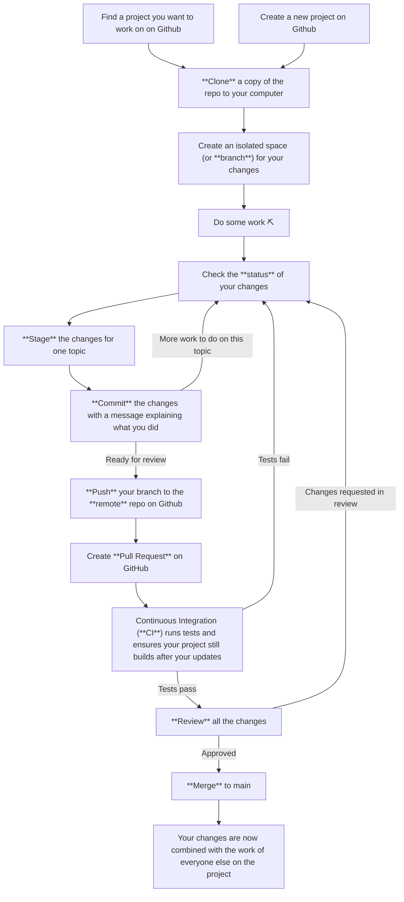

# Using `git` for Hardware

`git` is a powerful way to version control your design and one of the key reason we started atopile. If you don't know about `git`, we strongly recommend learning it. There is a high chance you will end up loving it.

## Workflow Overview

`git` is the de-facto standard for version control in software development. For people who haven't used it before, it's worth explaining a few terms and the workflow

| Term | Definition |
| --- | --- |
| Repo or Repository | A collection of files and directories that is version controlled together. |
| Branch | A "branch" is an isolated space for your changes. |
| Commit | A "commit" is a snapshot of some changes in that place in time. |
| Push | A "push" is sending your changes to the remote repo. |
| Pull Request | A "pull request" is a request to merge your changes into the main branch. This is the time to review and test your changes with others on your team. |



## Basic Usage

```sh
git clone <repo-url>
git checkout -b <new-branch-name>
git add <file-to-commit>
git commit -m "This commits adds an LED indicator..."
git push -u origin HEAD
```

## More resources

- https://github.com/git-guides
- https://git-scm.com/docs/gittutorial
