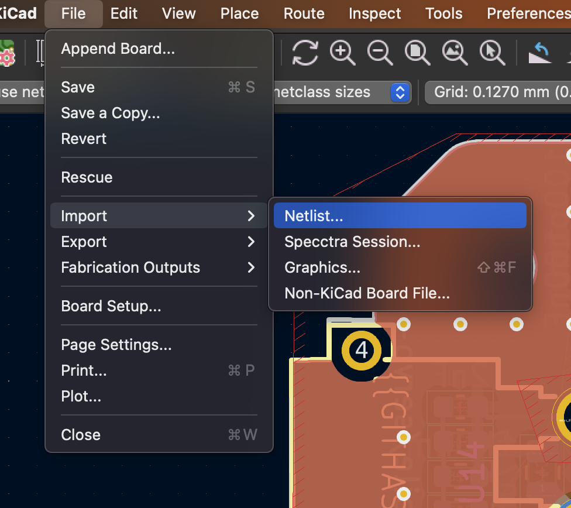
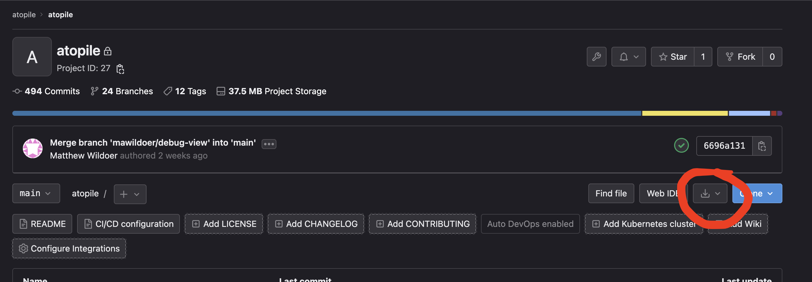

# atopile

`atopile` brings the best of software development to the world of hardware design.

We're starting with an electronics compiler and a new language called `ato`. Files with the `.ato` extension can be used to describe your circuit, and compiles it to netlists that can be laid out and fabricated.

The `.ato` files are human readable and can be version controlled, so you can collaborate with your team on the design of your hardware. They're modular, so you can reuse components from other projects, and share them with the community. They provide a way to save the intelligence of your design and the validation required to make sure it works as intended, so you can be confident that your design will work as expected.

# Getting started

To get started, you can invoke the `ato create 'path/to/your project's name` command. This will clone the [template project](https://gitlab.atopile.io/atopile/atopile-project-template) in your local directory and create a remote directory in atopile's gitlab instance.

You can find inspiration in a more advanced project like the servo-drive: [https://gitlab.atopile.io/atopile/servo-drive](https://gitlab.atopile.io/atopile/servo-drive)

## Intentional Omissions

- Detailed Installation -> instructions are in the `atopile` project's (README.md)[https://gitlab.atopile.io/atopile/atopile/-/blob/main/README.md?ref_type=heads] and are fluid since there's a bunch of not-so-well-packaged components at the moment
- Creating new projects -> we are activelly working on the language synthax. New keywords and features will be intorduced in the future with potential breaking changes to previous versions of `.ato` files.

## Project structure

The root of an ato project is marked by the presence of an `ato.yaml` file.

`ato.yaml` contains some project configuration information like the list of things you want to build. It's similar in concept to a `package.json` in js/node/npm land.

Here's an example:

```yaml
# this line defines the version of compiler required to compile the project
ato-version: ^0.0.18
# those line defines the path where the build artifact will be placed by the compiler
paths:
  build: ../../build/
# those lines define the elements that will be built by the compiler
builds:
  default:
    # we don't have a default root file yet
    targets:
      - netlist-kicad6
      - designators
      - bom-jlcpcb
```

The compiler version follows [sementic versioning](https://semver.org). The required version to compile your project can be specified using [npm's standard](https://docs.npmjs.com/about-semantic-versioning).

## Adding components to your project

Components and footprints can be added manually to your project. For convenience, you can also use the `ato install` command. Here is an example installing the (RP2040 chip)[https://www.lcsc.com/product-detail/Microcontroller-Units-MCUs-MPUs-SOCs_Raspberry-Pi-RP2040_C2040.html]:

`ato install --jlcpcb 'C2040'` 

The command will add your footprint and 3D representation to the KiCAD library (named lib in your folder structure) and create an ato file of the component.

## Imports

You can import assets by specifying what you want to import and where you want to import it from using the following syntax:

`import What from "where.ato"`

Notes on that statement:
- add quotes on the "where.ato" - it's a string
- `What` is capitalised - it's a type and types should be capitalised, though this isn't enforced and you can import things other than types from other files

The import statements are with respect to the current project, or within the standard library (`std`)

## Basic types

There's a handful of major types that you'll use in your `.ato` files, falling into two categories; blocks and nodes.

Blocks represent something that can contain other things. They provide an abstration over their contents. For example, a block could be power supply chip and all the passive components around it.

Nodes are elements you can connect to.

Block types are:
- `component` - represents exactly one component
- `module` - a collection of components and other modules
- `interface` - walks the line between a block and a node. It's a connectable block that let's you connect multiple nodes at a time

Node types are:
- `pin` - represents a physical pin/pad on a package
- `signal` - represents a logical signal that can be connected to other signals


## Block definition

Here is an example of a block (in this case a `component`) created within a file named `led.ato`:

```ato
component LED:
    signal positive  # declare a signal named "positive"
    positive ~ pin 1  # connect that "positive" signal with pin 1
    signal negative ~ pin 2  # declare a signal named "negative" and connect it with pin 2 in one line
    footprint = "Resistor_SMD:R_0603_1608Metric"  # yeah, I know this is a resistor package, but bare with me
```

## Viewing your first component

`ato view` is still in development. Please expect the feature to be unstable.

`ato view --help` will give you a printout of the options it can take.

atopile paths are in the form `path/to/file.ato:module.within.file`

To view, the LED component for example: `ato view led.ato:LED`

You should get a browser window popping up and wham! bam! alakazam! you've got a component!

## Adding footprints to your project

[JLCPCB](https://jlcpcb.com/) is a great place to get cheap PCBs made. They have a [library](https://jlcpcb.com/parts) of footprints that you can use.

To pull in a footprint, we've been using the wonderful tool [easyeda2kicad](https://pypi.org/project/easyeda2kicad/).

Add it to your python environment with `pip install easyeda2kicad`

Then you can download JLCPCB/EasyEDA/LCSC footprints with `easyeda2kicad --full --lcsc_id=<LCSC-num> --output ../lib/lib`

## Building the netlist

`ato build` is the tool for you!

For example: `ato build --target=netlist-kicad6 led.ato:LED`

This will generate a netlist in the `build/default` directory.

You can build any supported target with this same command just by changing the value of the `--target` option.

## Importing to KiCAD

While creating a new project and where to place your KiCAD files is out of scope of this tutorial, if you simply need to reimport a netlist into KiCAD, you can do the following:

1. File -> Import Netlist

1. Select the netlist you've just generated. The output is in the terminal, but it should approximately be servo-drive/build/servo-drive.net
2. Make sure you're using unique IDs, rather than designators (though they should work too)
3. Ruthlessly destroy stuff that's not supposed to be there (check boxes on the right)

1. Check the errors - sometimes it's important

In case you want to setup your own project, we have prepared a template with sample `ato` code and KiCAD project. Find it [here](https://gitlab.atopile.io/atopile/atopile-project-template).

## More on blocks

Like classes in most modern languages, we can subclass and inherit from blocks.

```ato
module SomeModule:
    signal some_signal
    signal gnd
    some_variable = "some value"

module SubclassedModule from SomeModule:
    # inherits all the signals and variables from SomeModule
    # we don't need to declare the signals again, but we will replace the value of some_variable
    some_variable = "some other value"

module Test:
    signal gnd
    subclased_module = new SubclassedModule  # creates an instance of the SubclassedModule
    subclased_module.gnd ~ gnd  # connects the some_signal of the SubclassedModule to the gnd of Test
```

**note**: we can subclass a module as a component, but not the other way around. A component is expected to represent a specific component.

This subclassing is also useful for creating typed interfaces:

```ato
interface I2C:
    signal sda
    signal scl

module SomeModule:
    i2c = new I2C

module Test:
    a = new SomeModule
    b = new SomeModule
    a.i2c ~ b.i2c  # connects both sda and scl in one fell swoop
```

## `->` the replace operator

This operator allows you to increase the specificity of a block somewhere.

Take the following example:
1. You want to create a reusable half-bridge module
2. If you spec the FETs within the module, you can't readily reuse the design in other projects with other FETs
3. If you don't declare the FETs at the bottom level it's a PITA to use, since every time you use it you need to remember to slot the FET in the right spot

You want some way to say "we're putting a FET here, but we'll tell you which FET later"

Subclassing is the way you say what a FET is, the replacement operator gives you the later.

```ato
module NFET:
    signal gate
    signal source
    signal drain

module HalfBridge:
    signal high
    signal low
    signal output
    signal high_gate
    signal low_gate

    high_fet = new NFET
    low_fet = new NFET

    # let's pretend we do something useful here like hook it all up

# some time later... perhaps in another file

component SomeNFET from NFET:
    footprint = "TO-220-3_Vertical"  # this isn't a legit package, but you get the idea

module MotorController:
    a = new HalfBridge
    # ...
    # replace the fets with a SomeNFET
    a.high_fet -> SomeNFET
    a.low_fet -> SomeNFET
```

# Version control using git

## Get stuff from the server / sync
git fetch origin <some-branch>
git pull

## Make a new branch

`git checkout -b <branch-name>`

`git checkout -b <branch-name> <from-branch>`

eg. `git checkout -b mawildoer/new-feature origin/main`

## Save some work

### 1.

`git add <whatever-you-wanna-save>`

`git add .`  -- save everything I've changed (including perhaps things we forgot to `.gitignore`)

### 2.

`git commit`

`git commit -m "<message-here>"`

## Push it back for everyone else

`git push` works if you didn't spec a "from" branch in `git checkout -b ...`

`git push -u origin HEAD` always works

Will respond with a way to make a branch:

```
remote:
remote: To create a merge request for mawildoer/dummy-branch, visit:
remote:   https://gitlab.atopile.io/atopile/servo-drive/-/merge_requests/new?merge_request%5Bsource_branch%5D=mawildoer%2Fdummy-branch
remote:
To gitlab.atopile.io:atopile/servo-drive.git
```

Cmd+<click> on the link to gitlab

# Manufacturing outputs
Our CI pipeline will automatically generate the following outputs for you:

- Gerbers (with githash automatically stamped on it!)
- BOM
- Pick and place file

## Gitlab artifacts
To download the artifacts, go to the pipeline page and click on the download button:


download the "store-build:archive" artifact and extract, you should see soemthing like this:

