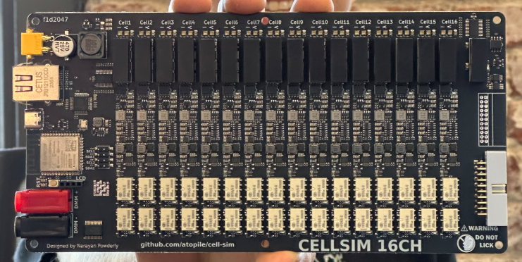
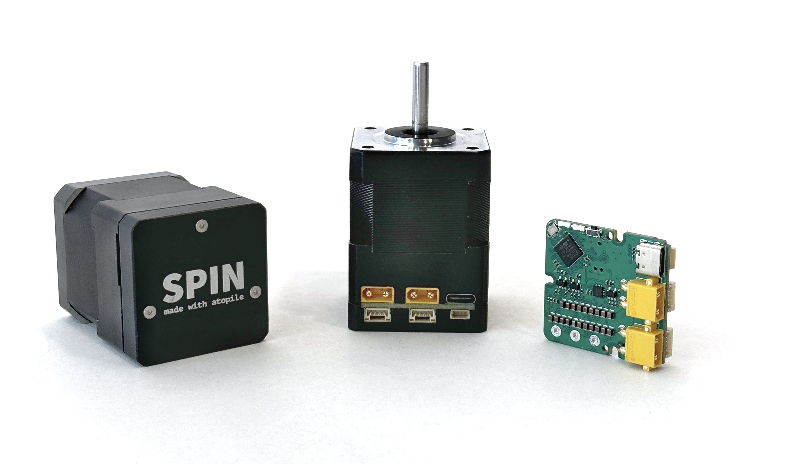

# Welcome

`atopile` is a language, compiler and toolchain to design electronics with code.

Design circuit boards with the same powerful workflows that software developers use - version control, modularity, and automated validation. Instead of point-and-click schematics, use human-readable `.ato` files that can be version controlled and shared. Capture design intelligence and validation rules in code to ensure your hardware works as intended.

## Features

- 🚀 Auto-select components like resistors and capacitors, based on their attribute's values
- 🤖 Embed calculations in your code, which are checked on every build
- 🧱 Build you circuit from reliable configurable modules so you can focus on high level design
- 💥 Build, release and test your circuit board from the `CLI`
- 📦 Embedded package manager to install and manage modules from https://packages.atopile.io, or Github
- 🔍 Version control line-by-line diffable code w/ git

Jump right in with the [quickstart guide](quickstart.md)

## Who's atopile for?

Currently atopile is young - which means we can't do everything yet and we're focussed on being incredible at a few things:

### Custom Validation Equipment

> "Rome wasn't built in a day, but your HiL should be"

If you're serious about automating the validation of your production hardware, you're in the right place.

[Cell-sim](https://github.com/atopile/cell-sim/) is a 16ch, 16-bit, isolated, 0-5V, 0-500mA battery-cell simulator designed from scratch in atopile, from concept to 2-revisions in under 5 days work. Oh, and that time includes the firmware. It is a relatively complex HiL design, and required many new modules that didn't yet exist on our package manager. Simpler HiL designs are frequently just a day's work.

### Young companies who need to iterate on hardware

`atopile` designed hardware is in satellites, humanoid robots and VTOL drones - all from startups within the last year.

Not every young company NEEDs to iterate on it's hardware, but many more should than do.

We're used to this in the software world, but getting the same engine running at even remotely similar speeds for hardware is a huge challenge. `atopile` let's multiple people work on different features or concepts on the same project in parallel via branches in `git`. With calculations checked and tests run automatically on every change, you can iterate as an individual - quickly trying out new ideas before committing to a design as a team and only after validating it in the real-world.

### Huge nerds 🤓

Welcome the club!

If you like making dope stuff, like these [servo drives](https://github.com/atopile/spin-servo-drive) you're in the right place. Welcome!

## Roadmap

### Up-next

- [ ] 📦 [Package Manager](https://github.com/atopile/atopile/discussions/495) - Make finding, installing and publishing modules fast and easy
- [ ] First-party packages for HiL systems

### Soon

- [ ] Language Server - A standard LSP server for atopile
- [ ] Plugin system - Make it easy to extend the `ato` CLI

### Non-goals

- Integration with XXX design tool. Reliably supporting all the features of legacy EDA tools is a huge lift, and, with rapid continued improvement in the open-source EDA space, it's not currently the best use of our time.
