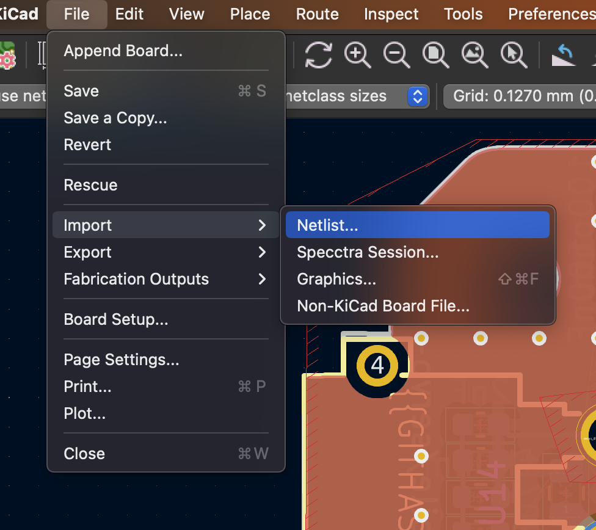
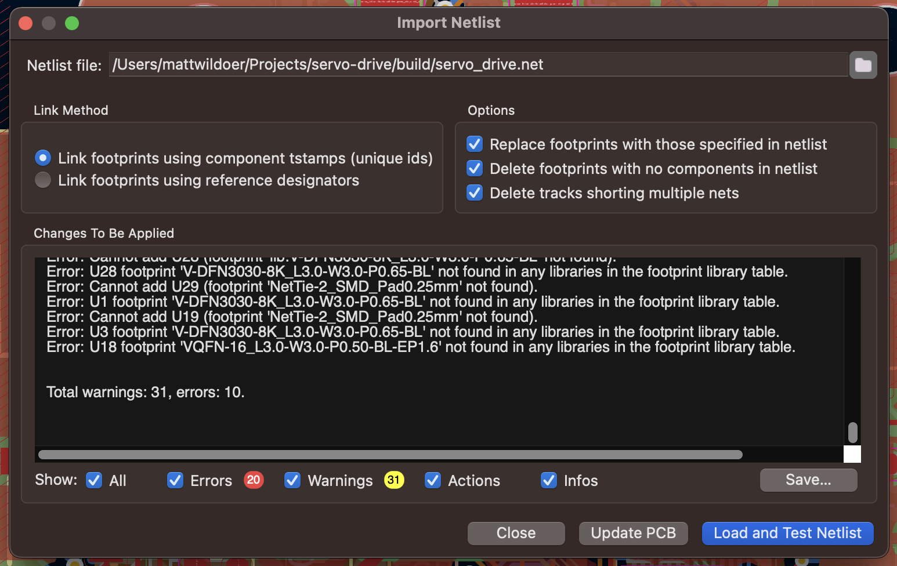
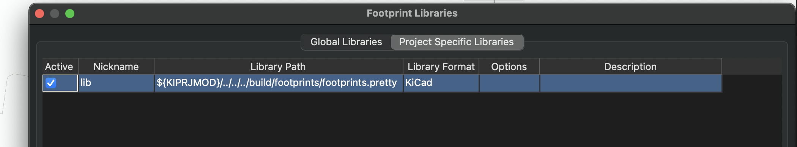
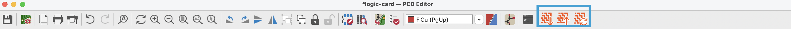
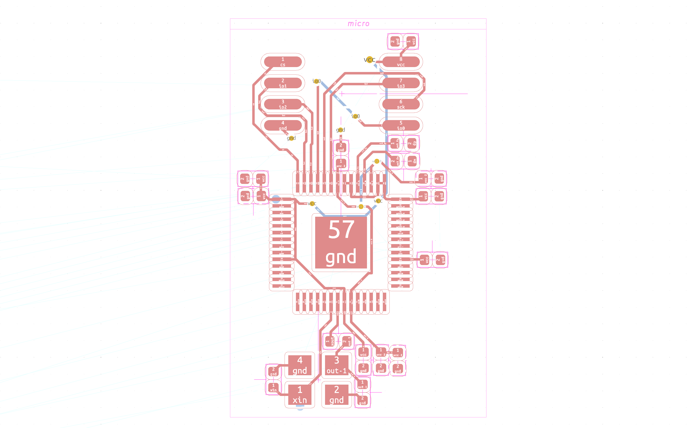

# KiCAD layout

## KiCAD installation

To use atopile, you will need to install KiCAD. You can find it [on KiCAD's official website](https://www.kicad.org/download/).

## Import netlist into KiCAD

Follow this procedure to import a netlist into KiCAD:

1. File -> Import Netlist

1. Select the netlist you've just generated. The output is in the terminal, but it should approximately be servo-drive/build/servo-drive.net
2. Make sure you're using unique IDs, rather than designators (though they should work too)
3. Ruthlessly destroy stuff that's not supposed to be there (check boxes on the right)

1. Check the errors - sometimes it's important

In case you want to setup your own project, we have prepared a template with sample `ato` code and KiCAD project. Find it [here](https://github.com/atopile/project-template).

!!! tip

    KiCAD needs to know where to look for the project's footprint. The `fp-lib-table` file points it to `build/footprints/footprints.pretty` which contains all the footprints. Make sure that is the case under preferences>manage footprint libraries. It should look like this:
    

## Layout reuse
atopile allows you to reuse the layouts that are defined in your dependencies. You will need the atopile KiCAD plugin installed which should happen automatically when installing the atopile cli. You should see those three buttons at the top of your KiCAD interface.

---
:fontawesome-brands-youtube:{ style="color: #EE0F0F" }
__[atopile Layout Reuse]__ – :octicons-clock-24:
3m – atopile Layout Reuse.

  [atopile Layout Reuse]: https://www.youtube.com/watch?v=qh8yZC_pkG8

---

### Steps

1) Start by adding a module to your project using [`ato install`](install.md/#installing-packages).

2) Add an instance of that package's module to your project and build the project

3) Open your project's KiCAD layout and import the netlist

4) Click the Reload Group button. This will recognize the modules that are in your layout and group them.

5) Select the group that you want to apply the auto layout on.

6) Click the Download button. THis will apply the layout to that group.

Groups will look like that:

Try it out with the [RP2040 module](https://packages.atopile.io/package/rp2040)!

### Button function

  
*Download button:* This button will apply the layout that is defined in your dependency to your current layout.

  
*Upload button:* This button will save your current layout to the your module. This is useful if you have a module in your current layout that you would like to save in the module and share with other projects.

  
*Reload button:* This button will create groups of components following the dependencies that you added for your project.

### How it actually works

As you build your project, a `manifest.json` is created in the build directory. The manifest links your KiCAD pcb payout file to a `<your-project>.layouts.json`. This file lists out all the modules that are in your layout and the map of the unique IDs in the current project to the ones in the dependency that you are trying to pull the layout from. It also provides the address of where the layout reuse is located.