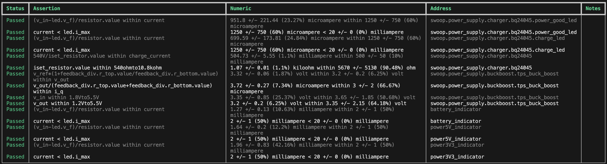
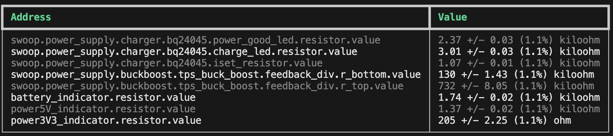

# Units and tolerances, assertions and maths :nerd_face:

Remember how NASA slung a rocket straight into Mars because of a metric/imperial boo boo?

How about we don't do that again.

## Units

Resistors's resistances must be a resistance; whether `1.23Ω` (option+Z on OSx), `1.23ohm`, `4.56Kohm`, `7.89Mohm` or similar.

Any attribute of any block may have a unit attached written (without a space) after any number.

Unsurprisingly, caps capacitances need to be a capacitance; eg. `23.4uF`, various limits in volts, amperes, degrees and so on.

Add units.

## Tolerances

Another unfamiliar first-class language feature when dealing with the physical world is the ability (and generally requirement)
to spec tolerances for attributes.

You could try find a `10kΩ` resistor, but my money says you won't - it'll likely be at least `10kΩ +/- 0.1%` (which you can
write!)

Tolerances can be written in the forms of:
- `1V to 2V`
- `3uF +/- 1uF`
- `4Kohm +/- 1%`

These are hopefully sufficiently intuitive as to not warrant further explanation 🤞


## Units and Tolerances

With Units and Tolerances together, we can define Physical attributes.

There's quite a few legal ways to combine them!

- `3V to 3.6V` perhaps for a supply rail
- `3V +/- 10mV` maybe for a reference
- `4.7uF +/- 20%` for a generic cap
- even `25lb +/- 200g` 🤣


## Sweet, so now I've got all these values around the place... what can I do with them?

:sparkles: **Maths** :sparkles:

There are two things that atopile can do for you with these values:
1. Check that assertions about their relationships to one another are true
2. Solve systems of constraints based on these relationships for find component values

This maths is all done including the units and tolerances, so you can be sure absolutely sure everything always works.

Use the `assert` keyword to apply constraints on the values of attributes to one another.

Supported operators are currently `<`, `>` and `within` (all are inclusive of the bounds).

```atopile
a = 1 ± 0.1
b = 2 ± 0.2
c: resistance  # variable declaration without assignment

assert a < b  # always true before 0.9 and 1.1 (the bounds of a) are both lower than the bounds of b (1.8 and 2.2)
assert a > b  # always false --> Will yield a failure at compile time
assert c within 1Kohm to 10Kohm  # first solved for, then the solution is independently checked at the end of the build
```

### Assertion checking

Who else has had conversations along the lines of "Is it cool if I tweak the value of this resistor?" "Uhh... good question! I think so?".

Well, do we have a treat for you (both the person asking and the person being asked)!

atopile will check all the assertions in your design for you - giving you a heap more freedom to play with the values of things, knowing your computer is taking care of checking it for you.




### Solving

I'm not sure about you, but I (Matt) am pretty dumb and don't love working too hard.
Perhaps you've got a better method, but generally when I'm trying to find resistor values for something even as simple as a voltage divider, I guess one that seems approximately right, then calculate the other - giving me something that doesn't exist, before finally checking through a few other options close-by until finding a pair that works.

This is fine and dandy as long as you only care about the ratio of a voltage divider, but as soon as you need to check what that does for your regulators output voltage? Ergh, fine! What about the extremes of the tolerances on those resistors? Fine I'll do it once - but I swear if someone goes to tweak those values for whatever reason, I am unlikely to be pleased.

So, let's get atopile to do it for us!

atopile will automatically solve systems of constraints for you with free variables, and check that the values of attributes are within their tolerances.


