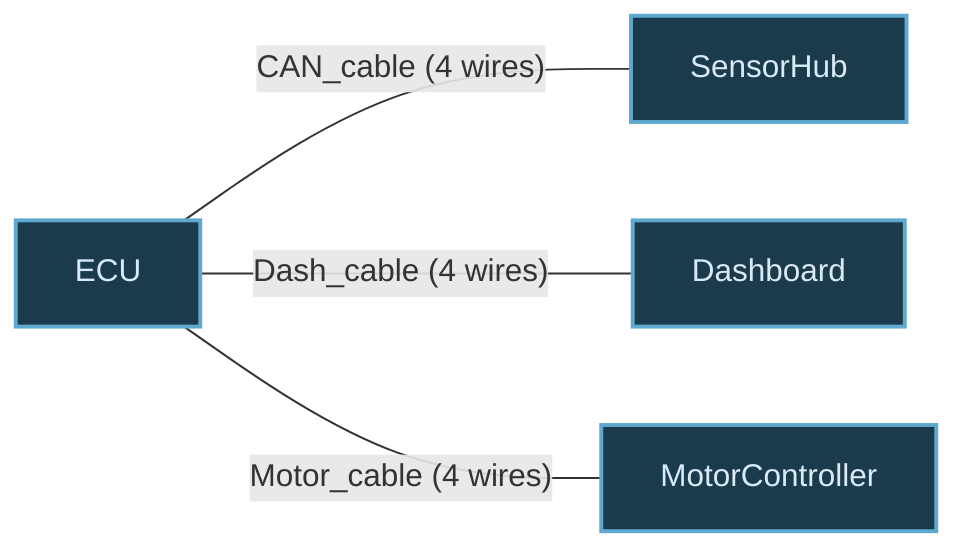

# Multi-Board Harness Design

Define multiple PCBs, connectors, cables, and wire harnesses in a single atopile project. Get automatic cross-board DRC, WireViz harness documentation, and system-level Mermaid diagrams.

## Architecture

```
                    .ato source files
                          |
                    +-----------+
                    | Compiler  |  (reads is_board, is_harness, etc.)
                    +-----------+
                          |
                  Instance Graph
                    /     |     \
          +--------+  +--------+  +----------------+
          | ERC    |  | Cross- |  | Harness        |
          | Check  |  | Board  |  | Exporter       |
          |        |  | DRC    |  |                |
          +--------+  +--------+  +---+-----+------+
                                      |     |
                               WireViz    Mermaid
                               YAML       Diagram
```

### Component Overview

| Component | File | Purpose |
|---|---|---|
| **Marker Traits** | `src/faebryk/library/is_board.py` etc. | Semantic tags for boards, harnesses, connectors |
| **Connector4Pin** | `src/faebryk/library/Connector4Pin.py` | 4-pin two-sided connector module |
| **Cable4Wire** | `src/faebryk/library/Cable4Wire.py` | 4-conductor cable module |
| **Cross-Board DRC** | `src/atopile/cross_board_drc.py` | Validates inter-board connections |
| **Harness Data** | `src/faebryk/exporters/harness/harness_data.py` | Graph-to-data extraction |
| **WireViz Export** | `src/faebryk/exporters/harness/wireviz_export.py` | YAML output for WireViz |
| **System Diagram** | `src/faebryk/exporters/harness/system_diagram.py` | Mermaid system diagram |

---

## Semantic Traits

Five marker traits tag modules with their role in the multi-board system:

| Trait | Usage | Meaning |
|---|---|---|
| `is_board` | `trait is_board` | This module is a PCB board |
| `is_multiboard` | `trait is_multiboard` | Top-level multi-board system |
| `is_harness` | `trait is_harness` | This module is a wire harness |
| `is_connector_plug` | `trait is_connector_plug` | Connector is a plug (male) |
| `is_connector_receptacle` | `trait is_connector_receptacle` | Connector is a receptacle (female) |

All traits follow the `is_sink` pattern:

```python
import faebryk.core.node as fabll

class is_board(fabll.Node):
    is_trait = fabll.Traits.MakeEdge(fabll.ImplementsTrait.MakeChild().put_on_type())
    is_immutable = fabll.Traits.MakeEdge(fabll.is_immutable.MakeChild()).put_on_type()
```

---

## Two-Sided Connector Model

`Connector4Pin` has two sets of interfaces:

- **`board_side[0..3]`** — Electrical pads that get soldered to the PCB. Each has a Lead trait so it can attach to a footprint pad.
- **`wire_side[0..3]`** — Cable termination points.

Internal passthrough connects each `board_side[i]` to `wire_side[i]`.

```
             Connector4Pin
    ┌──────────────────────────────┐
    │  board_side[0] ──── wire_side[0]  │
    │  board_side[1] ──── wire_side[1]  │
    │  board_side[2] ──── wire_side[2]  │
    │  board_side[3] ──── wire_side[3]  │
    └──────────────────────────────┘
         PCB pads         Cable side
```

Usage in `.ato`:

```ato
#pragma experiment("TRAITS")

import Connector4Pin
import is_connector_plug

module MyBoard:
    trait is_board
    connector = new Connector4Pin
    trait connector is_connector_plug

    # Wire internal signals to the connector's PCB pads
    power.hv ~ connector.board_side[0]
    power.lv ~ connector.board_side[1]
```

---

## Parametric Cable Module

`Cable4Wire` bridges two ends with a parametric length:

```
              Cable4Wire
    ┌──────────────────────────────┐
    │  end_a[0] ──────── end_b[0]  │
    │  end_a[1] ──────── end_b[1]  │
    │  end_a[2] ──────── end_b[2]  │
    │  end_a[3] ──────── end_b[3]  │
    │                              │
    │  length: Parameter (meters)  │
    └──────────────────────────────┘
```

Usage in `.ato`:

```ato
import Cable4Wire

module MyHarness:
    trait is_harness
    cable = new Cable4Wire

    side_a.wire_side[0] ~ cable.end_a[0]
    cable.end_b[0] ~ side_b.wire_side[0]
```

---

## Complete Example: `examples/multiboard_led/`

A two-board LED system with a driver board, LED panel, and connecting harness.

### File Structure

```
examples/multiboard_led/
├── ato.yaml
├── system.ato        # Top-level multi-board system
├── driver_board.ato  # Power driver board
├── led_panel.ato     # LED panel board
└── harness.ato       # Wire harness with cable
```

### `system.ato` — Top-Level System

```ato
#pragma experiment("TRAITS")

import is_multiboard
from "driver_board.ato" import DriverBoard
from "led_panel.ato" import LEDPanel
from "harness.ato" import LEDHarness

module LEDSystem:
    trait is_multiboard

    driver = new DriverBoard
    panel = new LEDPanel
    harness = new LEDHarness

    # Connect boards through harness
    driver.harness_out.wire_side[0] ~ harness.side_a.board_side[0]
    driver.harness_out.wire_side[1] ~ harness.side_a.board_side[1]
    driver.harness_out.wire_side[2] ~ harness.side_a.board_side[2]
    driver.harness_out.wire_side[3] ~ harness.side_a.board_side[3]

    harness.side_b.board_side[0] ~ panel.harness_in.wire_side[0]
    harness.side_b.board_side[1] ~ panel.harness_in.wire_side[1]
    harness.side_b.board_side[2] ~ panel.harness_in.wire_side[2]
    harness.side_b.board_side[3] ~ panel.harness_in.wire_side[3]
```

### `driver_board.ato` — Power Driver Board

```ato
#pragma experiment("TRAITS")

import Resistor
import ElectricPower
import Connector4Pin
import is_board
import is_connector_plug

module DriverBoard:
    trait is_board

    power = new ElectricPower
    assert power.voltage within 5V +/- 10%

    current_limit = new Resistor
    current_limit.resistance = 100 ohm +/- 5%

    harness_out = new Connector4Pin
    trait harness_out is_connector_plug

    power.hv ~ current_limit.unnamed[0]
    current_limit.unnamed[1] ~ harness_out.board_side[0]
    power.lv ~ harness_out.board_side[1]
```

### `harness.ato` — Wire Harness

```ato
#pragma experiment("TRAITS")

import Cable4Wire
import Connector4Pin
import is_harness
import is_connector_receptacle
import is_connector_plug

module LEDHarness:
    trait is_harness

    side_a = new Connector4Pin
    trait side_a is_connector_receptacle

    side_b = new Connector4Pin
    trait side_b is_connector_plug

    cable = new Cable4Wire

    side_a.wire_side[0] ~ cable.end_a[0]
    side_a.wire_side[1] ~ cable.end_a[1]
    side_a.wire_side[2] ~ cable.end_a[2]
    side_a.wire_side[3] ~ cable.end_a[3]

    cable.end_b[0] ~ side_b.wire_side[0]
    cable.end_b[1] ~ side_b.wire_side[1]
    cable.end_b[2] ~ side_b.wire_side[2]
    cable.end_b[3] ~ side_b.wire_side[3]
```

---

## Cross-Board DRC

When the top-level module has `trait is_multiboard`, the build pipeline automatically attaches a `needs_cross_board_drc` check. It runs at the `POST_INSTANTIATION_DESIGN_CHECK` stage and catches three violation types:

### `MISSING_HARNESS`

Cross-board electrical connection without a harness path.

```
ERROR: Cross-board connection between [driver, panel]
       does not pass through a harness
```

**Fix:** Route all inter-board connections through a harness module with `trait is_harness`.

### `GENDER_MISMATCH`

Same-gender connectors mated (plug to plug, or receptacle to receptacle).

```
ERROR: Same-gender (plug) connectors mated:
       [driver.harness_out, panel.harness_in]
```

**Fix:** Ensure mated connector pairs use `is_connector_plug` on one side and `is_connector_receptacle` on the other.

### `FLOATING_ENDPOINT`

Harness connector not connected to any board.

```
ERROR: Harness endpoint harness.side_b.wire_side[0]
       in harness is not connected to any board
```

**Fix:** Connect all harness endpoints to board connectors.

---

## Build Target: `harness-diagram`

Run:

```bash
ato build --target harness-diagram
```

This produces two output files in the build directory.

### Output 1: WireViz YAML (`harness.yml`)

Compatible with [WireViz](https://github.com/formatc1702/WireViz) for generating harness drawings.

**Simple example output:**

```yaml
connectors:
  driver.harness_out:
    subtype: male
    pinlabels: [pin1, pin2, pin3, pin4]
  harness.side_a:
    subtype: female
    pinlabels: [pin1, pin2, pin3, pin4]
  harness.side_b:
    subtype: male
    pinlabels: [pin1, pin2, pin3, pin4]
  panel.harness_in:
    subtype: female
    pinlabels: [pin1, pin2, pin3, pin4]

cables:
  harness.cable:
    wirecount: 4
    length: 0.3

connections:
  - [driver.harness_out, [1], harness.side_a, [1]]
  - [driver.harness_out, [2], harness.side_a, [2]]
  - [harness.side_a, [1,2], harness.cable, [1,2], harness.side_b, [1,2]]
  - [harness.side_b, [1], panel.harness_in, [1]]
  - [harness.side_b, [2], panel.harness_in, [2]]
```

**Complex FSAE-style output:**

```yaml
connectors:
  ECU.J1:
    subtype: male
    pinlabels: [CAN_H, CAN_L, V+, GND]
  ECU.J2:
    subtype: male
    pinlabels: [PWM1, PWM2, V+, GND]
  SensorHub.J1:
    subtype: female
    pinlabels: [CAN_H, CAN_L, V+, GND]
  MotorController.J1:
    subtype: female
    pinlabels: [PWM1, PWM2, V+, GND]
  Dashboard.J1:
    subtype: female
    pinlabels: [CAN_H, CAN_L, V+, GND]
  harness.ecu_side:
    subtype: female
    pinlabels: [CAN_H, CAN_L, V+, GND]
  harness.sensor_side:
    subtype: male
    pinlabels: [CAN_H, CAN_L, V+, GND]
  harness.dash_side:
    subtype: male
    pinlabels: [CAN_H, CAN_L, V+, GND]

cables:
  CAN_cable:
    wirecount: 4
    length: 1.2
  Motor_cable:
    wirecount: 4
    length: 0.8
  Dash_cable:
    wirecount: 4
    length: 0.5

connections:
  - [ECU.J1, [1], harness.ecu_side, [1]]
  - [ECU.J1, [2], harness.ecu_side, [2]]
  - [ECU.J1, [3], harness.ecu_side, [3]]
  - [ECU.J1, [4], harness.ecu_side, [4]]
  - [harness.ecu_side, [1,2,3,4], CAN_cable, [1,2,3,4], harness.sensor_side, [1,2,3,4]]
  - [harness.sensor_side, [1], SensorHub.J1, [1]]
  - [harness.sensor_side, [2], SensorHub.J1, [2]]
  - [harness.sensor_side, [3], SensorHub.J1, [3]]
  - [harness.sensor_side, [4], SensorHub.J1, [4]]
  - [ECU.J2, [1,2,3,4], Motor_cable, [1,2,3,4], MotorController.J1, [1,2,3,4]]
  - [harness.ecu_side, [1,2,3,4], Dash_cable, [1,2,3,4], harness.dash_side, [1,2,3,4]]
  - [harness.dash_side, [1], Dashboard.J1, [1]]
  - [harness.dash_side, [2], Dashboard.J1, [2]]
  - [harness.dash_side, [3], Dashboard.J1, [3]]
  - [harness.dash_side, [4], Dashboard.J1, [4]]
```

To render, pipe through WireViz: `wireviz harness.yml`

### Output 2: Mermaid System Diagram (`system_diagram.md`)

**Simple two-board system:**


**Complex FSAE-style system (4 boards, 3 cables):**



---

## Data Flow

```
 ato source  ──compile──>  TypeGraph  ──instantiate──>  InstanceGraph
                                                             │
                              ┌──────────────────────────────┤
                              │                              │
                     is_multiboard?                   is_board, is_harness
                              │                    is_connector_plug/receptacle
                              ▼                              │
                  attach needs_cross_board_drc               │
                              │                              │
                              ▼                              ▼
                   POST_INSTANTIATION              extract_harness_data()
                   _DESIGN_CHECK                         │
                        │                           ┌────┴────┐
                        ▼                           ▼         ▼
                  ┌─────────────┐            WireViz     Mermaid
                  │ 3 DRC rules │            YAML        Diagram
                  └─────────────┘
```

---

## File Reference

### New Library Files

| File | Lines | Purpose |
|---|---|---|
| `src/faebryk/library/is_board.py` | 7 | Board marker trait |
| `src/faebryk/library/is_multiboard.py` | 7 | Multi-board system marker trait |
| `src/faebryk/library/is_harness.py` | 7 | Harness marker trait |
| `src/faebryk/library/is_connector_plug.py` | 7 | Plug (male) connector marker trait |
| `src/faebryk/library/is_connector_receptacle.py` | 7 | Receptacle (female) connector marker trait |
| `src/faebryk/library/Connector4Pin.py` | 50 | 4-pin two-sided connector module |
| `src/faebryk/library/Cable4Wire.py` | 34 | 4-conductor cable module |

### Application Files

| File | Lines | Purpose |
|---|---|---|
| `src/atopile/cross_board_drc.py` | 250 | Cross-board DRC checks |
| `src/faebryk/exporters/harness/harness_data.py` | 200 | Graph-to-data extraction |
| `src/faebryk/exporters/harness/wireviz_export.py` | 120 | WireViz YAML output |
| `src/faebryk/exporters/harness/system_diagram.py` | 150 | Mermaid system diagram |

### Modified Files

| File | Change |
|---|---|
| `src/faebryk/library/_F.py` | Auto-regenerated with 7 new types |
| `src/atopile/compiler/ast_visitor.py` | Added to `STDLIB_ALLOWLIST` |
| `src/atopile/build_steps.py` | Cross-board DRC hook + `harness-diagram` build target |
