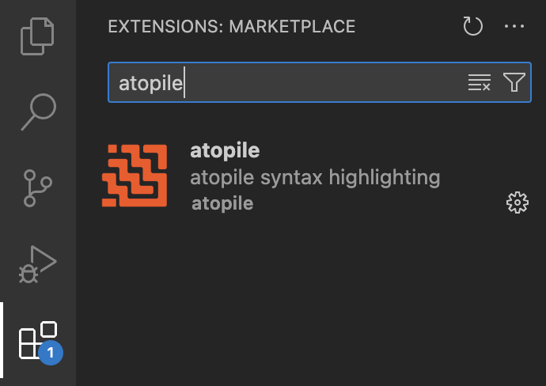

# Getting started

## Installation

To run atopile, you will need the atopile compiler, the VSCode extension for synthax highlighting and git credential manager.

### atopile compiler - with pip <small>recommended</small>

atopile is published as a [python package](https://pypi.org/project/atopile/) on pypi. You can install it using `pip` from your command line. We recommend setting up a virtual environment for atopile so that atopile's dependencies don't calsh with the rest of your system.

Start by making sure you have `python@3.11` or later installed on your machine.

Setup the venv:
``` sh
python3.11 -m venv venv
```
Actiavte the venv:
``` sh
source venv/bin/activate
```

Now you can install atopile:
``` sh
pip install atopile
```

atopile should be installed. You can verify that it worked with the following command which should give you the current version of atopile.
``` sh
ato --version
```
---

:fontawesome-brands-youtube:{ style="color: #EE0F0F" }
__[How to set up atopile]__ – :octicons-clock-24:
30m – We have a video of how to install atopile and setup your project here.

  [How to set up Material for MkDocs]: https://www.youtube.com/watch?v=Q-YA_dA8C20

---
## TODO: fix the link

### atopile compiler - with git

atopile can be directly installed from [GitHub](https://github.com/atopile/atopile) by cloning the repository into a subfolder of your project root. This could be useful if you want to use the latest version of atopile:

```
git clone https://github.com/atopile/atopile.git
```
This will create a repository with the latest version of atopile. You can install it using pip:

```
pip install -e atopile
```

### VSCode extension - extension store

We recomend using [VSCode](https://code.visualstudio.com) to run atopile as it will provide synthax highlighting.

From VSCode, navigate to the VSCode extensions and install atopile.

