# Quickstart

## Install `ato` — with `uv` <small>(recommended)</small>


1. Install `uv`. See: https://docs.astral.sh/uv/installation/

2. Install atopile with `uv`

    ``` sh
    uv tool install atopile
    ```

    !!! important
        `uv` if this is the first time you've used `uv` for a tool install, it might give you another command to run to finish setup.
        Do it.

4. Check `ato` is installed

    ``` sh
    ato --version
    ```

!!! info
    While we strongly recommend using `uv` to install atopile, it's ultimately a python package, so you can install it a few other ways.
    See the [installation guide](installation.md) for more details.


## Editor recommendations

atopile officially supports VSCode and Cursor.

We recommend using Cursor. AI is already getting very good at writing `ato` code.

Download it here: https://www.cursor.com/


## Installing KiCAD

If you are on OSx, and you have `brew` installed, you can install KiCAD with:

``` sh
brew install kicad
```

Otherwise, you can download it from here: https://www.kicad.org/download/


## A typical workflow

1. Sketch your circuit on paper.
2. Search https://packages.atopile.io and Github for pre-existing modules you need, and use `ato install` to install them.
3. Design a module and do it's calculations using `ato` code.
4. Run `ato build` to compile your project choose components to suit your design and update your layout (PCB) file.
5. Use KiCAD to layout any changes
6. Repeat steps 3-5 until you're happy with your design.
7. When you're done with your design, push your changes to your repo.
8. CI will automatically build and test your project, and generate the manufacturing files you need to order your PCBs.
9. Take these manufacturing files to your PCB manufacturer to get your PCBAs

``` mermaid
graph TB
  A[Sketch] --> AA['ato create project'];
  AA --> BB[Pick a module];
  BB --> B{Package exists?};
  B -->|Yes 🥳| C['ato install'];
  B -->|No| CC['ato create component' and Design it! 👨‍💻];
  C --> D[Hook it up];
  CC --> D;
  D --> E['ato build'];
  E --> F[Layout using KiCAD];
  F --> G{More modules to do?};
  G -->|Yes| BB;
  G -->|No 🎉| H[Download gerbers from CI ✅];
  H --> I[Order PCBs from manufacturer 🛠️];
```



## Creating a project

```sh
ato create project
```

And follow the prompts to create a new project from the template.

## Project Structure

Your new project will have a file structure like this:

```
.
├── LICENSE                    # 1. Default MIT license. You are free to change this
├── README.md                  # 2. A description of your project
├── ato.yaml                   # 3. atopile's configuration file
├── build                      # 4. Build artifacts and cache (not version controlled)
├── layouts                    # 5. KiCAD layout files
│   └── default                # 6. There's a directory / layout per "build target"
│       └── default.kicad_pcb  # 7. The layout file that will be updated every time you run `ato build -b default`
└── demo.ato                   # 8. Your atopile source file
```

The most important three files in there are:

- `demo.ato` - your atopile source file - this is where you write your atopile code
- `default.kicad_pcb` - the layout file - this is the "board" file that looks like a PCB, and you can order from
- `ato.yaml` - atopile's configuration file - this file is how atopile knows this is a project and what to do when you run `ato build`


## Hello, World!

Here's a simple example of atopile code:

```ato
--8<-- "examples/ch1_0_quickstart.ato"
```

Update `demo.ato` (of whatever you've named your source file) with this code.

To build it, run:

```sh
ato build --open
```

You should see a flurry of activity in the terminal with this message towards the end

```sh
INFO     Build successful! 🚀
```

Then KiCAD will open up (that's what the `--open` flag does).
You shiny ✨ new  component should be waiting for you in the top left corner (possibly off the current screen).


Oh yeah! We're in business. 😎


## What's next?

This isn't even a circuit yet, merely a single component however you now:

- Have the `ato` CLI and compiler setup and working
- Know how to add components to your design
- Have KiCAD installed and working

In the [tutorial](tutorial.md) we continue with a real circuit, installing and using packages, maths and version control.
