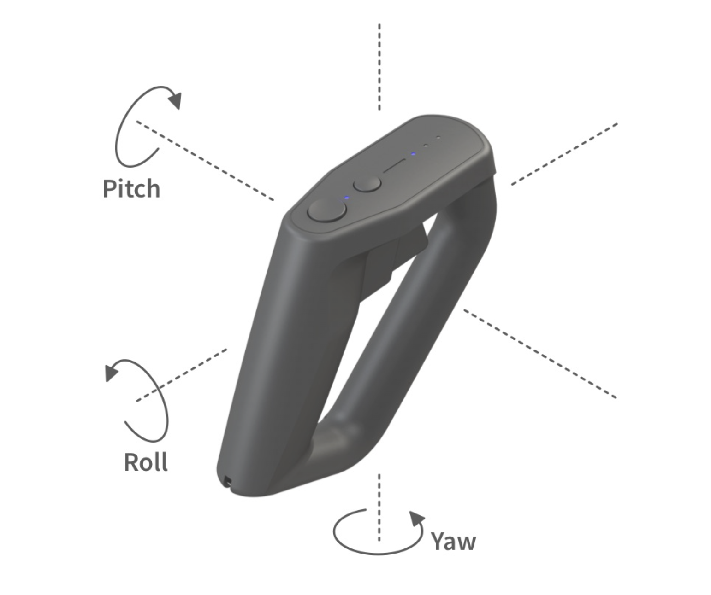
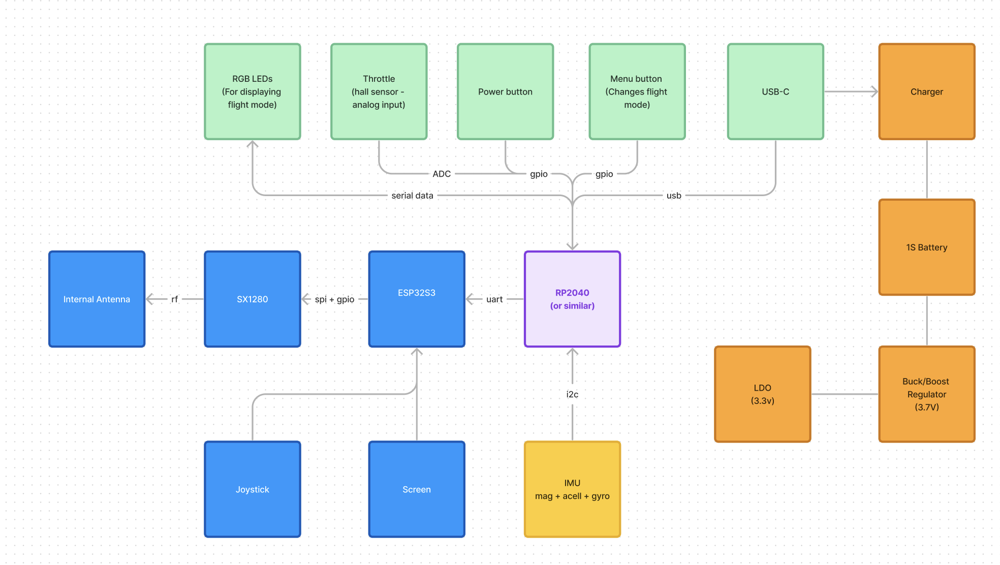
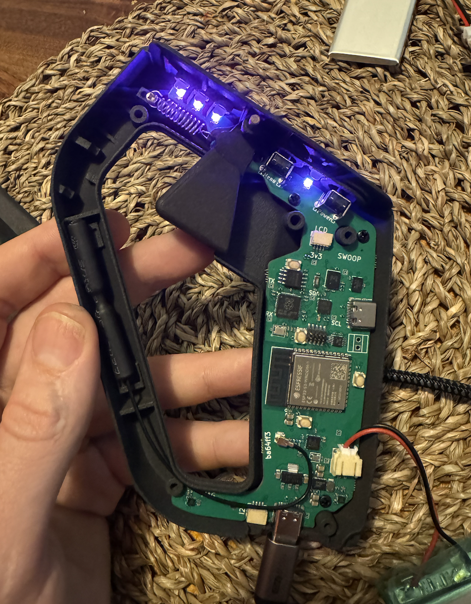

# Swoop
Swoop is an open-source motion based flight controller for drones. It uses an IMU to generate commanded yaw, pitch, and roll angles, and sends these commands to the flight controller over ExpressLRS.

## Specs

- 9-axis IMU (mag, gyro, accel)
- RP2040 (sensor fusion, throttle, status indication)
- ESP32 S3 (ExpressLRS)
- SX1280 transceiver (compatible with ExpressLRS)
- Powered by 1000mah internal LiPo battery (~ 4hrs of flight time)

### Block Diagram

## Features

- Status LEDs
- USB-C for programming and debugging
- hall-sensor for throttle control

## Roadmap

Second version of the board is currently in manufacturing to add CAN bus and I2C communication.

- [x] Power supply bring-up
- [x] Battery charging circuit bring-up
- [x] IMU bringup
- [ ] IMU calibration
- [ ] IMU sensor fusion
- [ ] ExpressLRS integration (FLRC)
- [ ] Binding with ExpressLRS receivers
- [ ] Add display and buttons for ExpressLRS configuration

### Initial Testing

## Documentation

Interested? We are looking for collaborators! Check out the [repo](https://github.com/atopile/swoop) and [discord](https://discord.gg/3AtvZ9Hu) for more information on how to get started!