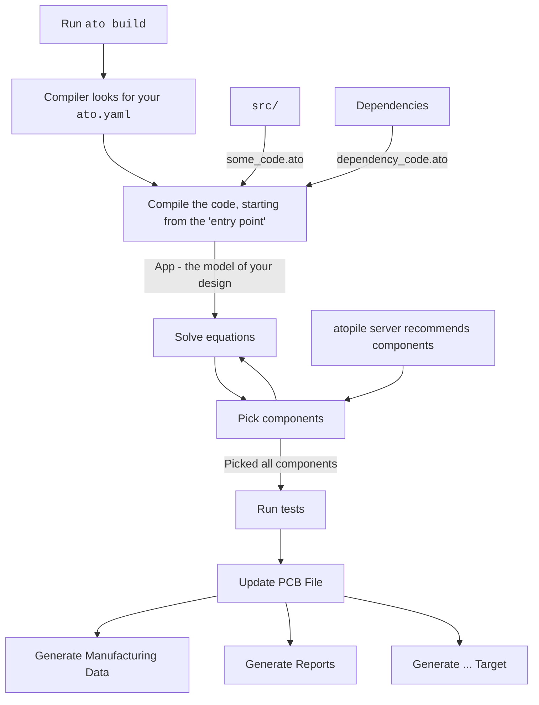

# 2. The `ato` compiler

The `ato` command line interface is the main way to interact with atopile.

The CLI has tools to:

 - Build your code to update your PCB
 - Test your design
 - Generate files to order your PCBs from manufacturers
 - Install and manage dependencies
 - Create new projects, components or build-targets

There's a semi-defacto-standard format to running applications from the terminal, including `ato`.

```sh
application command [options] arguments
```

1. `application` is the name of the application you're running.
2. `command` is the command, think of it as a "menu option" the application provides.
3. `options` are the options for the command, typically zero-to-many of `--some-option option-value`
4. `arguments` are just like options, but they only take a value. Their position tells the application which argument they are.

Add `--help` to the application/command/subcommand to get more information at any point.

!!! tip
    Some things might have multiple commands/subcommands. Think of it like a menu where, from left to right you're choosing deeper and deeper into the menu.

    If an upper command/application accepts options, those options should go right after the application/command, rather than at the end after subcommands.

    For example, `-v` is a special type of option, called a "flag", which doesn't take a value. It's presence or absence is what matters. It increases the amount of information the compiler will print -> increase it's verbosity.

    The `-v` flag is an application option, so to use it, place it right after the application name.

    ```sh
    ato -v build
    ```

## [Build Process](#build-process) {: #build-process }

As a rough overview, here's what happens when you run `ato build`:



## Explaining the hello-world project

!!! important
    This tutorial continues from the [quickstart](../quickstart.md) guide.

    If you haven't already, complete it, and then come back here.

With the additional explanation of `ato` code and the [build process](#build-process), it should be a little more clear what's happening now in the [quickstart](../quickstart.md) project.

```ato
--8<-- "examples/ch1_0_quickstart.ato"
```

Let's break it down:


### 1. Import a `Resistor`

```ato
--8<-- "examples/ch1_0_quickstart.ato:1:2"
```

### 2. Define a new `module`, named `App`

This is the [**entry point**](../reference/config.md#builds.entry) of the build (see your `ato.yaml`).

```ato
--8<-- "examples/ch1_0_quickstart.ato:3:3"
```

### 3. Create an instance of the `Resistor`

```ato
--8<-- "examples/ch1_0_quickstart.ato:4:4"
```

### 4. Set the resistor's `value` attribute

This constrains what components can be picked for this resistor.

For picking, the rated resistance must be wholely within the `value` attribute. The precise way to say this in more CS terms / what atopile says internally is that the picked resistor's resistance must be a subset of the quantity interval defined by the value attribute.

```ato
--8<-- "examples/ch1_0_quickstart.ato:5:5"
```

## Extending it

Let's say our circuit needs a simple voltage divider - and the standard library doesn't exist containing one pre-made and tested for you.

We can easily create our own!

```ato
--8<-- "examples/ch1_1_bad_voltage_divider.ato"
```

Now, this is, technically, a voltage divider. And the compiler will happily build it grabbing the right components etc...

But, it's not a good voltage divider.

 - There's no clear interface showing how it should be connected to
 - The point of a voltage divider is to scale voltage, but we're left in the dark about what it's scaling actually is
 - There is no documentation on what's going on

Let's fix that.

```ato
--8<-- "examples/ch1_2_good_voltage_divider.ato"
```

Ooooo yeah! Now we're talking.
