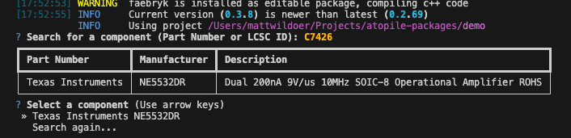

# 3. `ato create component`

This embedded tool will help template `ato` code based on a component. Today, it supports JLCPCB components.

It can run as both an interactive tool, or with command line arguments. Go ahead and run it interactively.

```bash
ato create component
```

You'll be prompted for a search term of a component. This may be:

 - A JLCPCB part number (e.g. `C7426`)
 - An **exact** manufacturer part number (e.g. `NE5532DR`)

Enter `C7426` and press enter.



Go ahead and tap `Enter` through the default options.

## Our new `component`

```ato
component Texas_Instruments_NE5532DR:
    """Texas_Instruments_NE5532DR component"""
    lcsc_id = "C7426"
    manufacturer = "Texas Instruments"
    mpn = "NE5532DR"
    datasheet_url = "https://www.lcsc.com/datasheet/lcsc_datasheet_1809301912_Texas-Instruments-NE5532DR_C7426.pdf"
    designator_prefix = "U"

    # pins
    signal IN1_ ~ pin 2
    signal IN1plus ~ pin 3
    signal IN2_ ~ pin 6
    signal IN2plus ~ pin 5
    signal OUT1 ~ pin 1
    signal OUT2 ~ pin 7
    signal VCC__GND ~ pin 4
    signal VCCplus ~ pin 8
```

Let's break it down.

The `component` keyword tells the compiler that we're specifying a new component class, which is a subclass of `module`.

The `lcsc_id` attribute tells the compiler it can pick that JLCPCB part to fill this spot.
The `manufacturer` and `mpn` attributes together tell fully specify which component this is as well.
If you're making a component class of a specific component, it's typically a good idea to include at least either the `lcsc_id` or the `mpn` + `manufacturer`.

The `datasheet_url` and `designator_prefix` attributes are optional, but it's a good idea to include them. They're self-explanatory.

### `pin`

The `pin` keyword is used to define electrical interfaces, which the compiler will map to pads on the footprint.

That is, `pin 2` says:

- Create a signal named `2` (pins are treated as a special-case where they're may have an integer name)
- Connect the signal to pad "2" on the footprint

## Good practice

Here are a few tweaks we recommend making to your component class:

### Abstract classes

When you're creating a class representing a specific component, for which there's a generic abstract class (eg. An `LDO`), import and subclass that abstract class to get it's generic methods and attributes.

For example, you should update the component class like this:

```ato
component Texas_Instruments_NE5532DR from LDO:
```

Then, connect its pins to the LDO's signals, set known attributes etc...

### Take the `mpn` and `manufacturer` from `ato create component`

`mpn` and `manufacturer` are only interpreted properly if they exactly match a component in our database.
