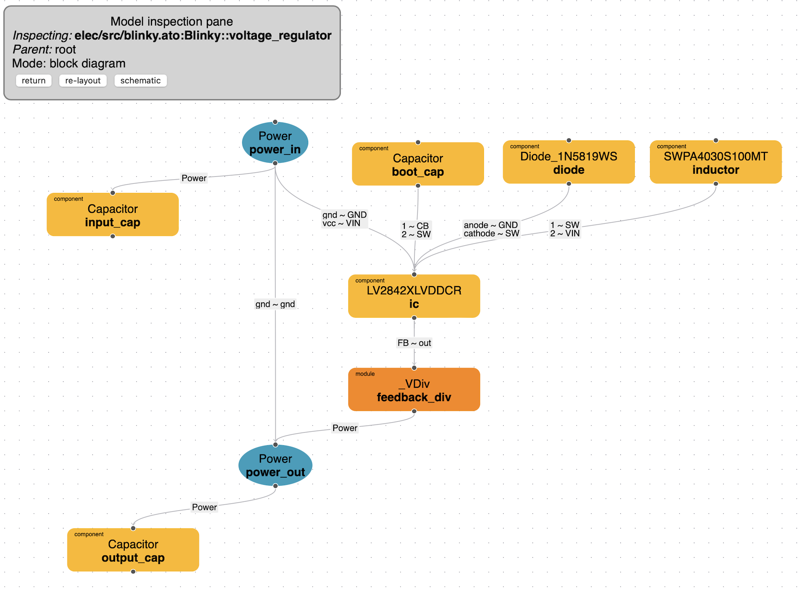
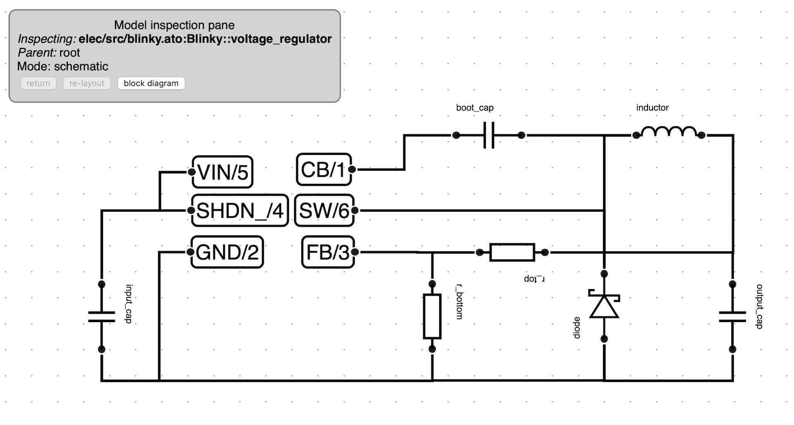

# atopile viewer

To use the viewer, invoke the `ato view` cli command:

``` sh
ato view
```

If you have multiple build configuration, specify the one you would like to view with:

``` sh
ato view -b <your-build-config-name>
```

The viewer will spool up a server on your local machine at [http://127.0.0.1:8080](http://127.0.0.1:8080).

## Viewer interfaces

### Block diagram



The block diagram is meant to provide a view that resembles your code structure. In the block diagram view, you will see the same signals and interfaces that are present in your code as well as how they interact with each other. This view will help you navigate through your project and it's structure.

#### Saving block position

We currently don't handle saving component position in the block diagram but we'll add this feature shortly. We do support that feature for the schematic though.

### Schematic



The schematic view follows a more standard view of your design. This view can be used for documentation or inspecting a more concrete view of your final circuit. The schematic view can be enabled by navigating with the block diagram to the block you want to inspect and pressing the schematic button. You can switch back to block diagram by pressing the same button.

The schematic diagram will represent all the components that are at the level or below the current module.

#### Supported components

For a component to show up on the schematic, it needs to be an instance of a component in the generics library. Here are the current components we support:

- Resistor
- Inductor
- Capcitor
- LED
- Powr
- NPN
- PNP
- Diode
- SchottkyDide
- ZeneDiode
- NFET
- PFET
- Opamp

Other larger components will show up as scattered signals that can be moved around to relevant places.

#### Selecting, moving, rotating, mirroring components

To select a component, simply click on it. To select multiple components, press the cmd/ctrl key while selecting nodes. To rotate, select a component and press the `R` key. To mirror a signal, you can use the `F` key (only signals can be mirrored for the moment). To move a component, simply drag and drop it with your mouse.

#### Saving component position

As you move components around, the `ato-lock.yaml` file located in the root of your project will be updated to store the position, rotation angle and mirroring state of components. Make sure to add this file to your git repository if you'd like save those positions. Signals on the schematic can only be mirrored but not rotated. Components can only be rotated in increments of 90 degrees (0, 90, 180, 270) but not mirrored (yet). We don't currently handle saving position in the block diagram.

## Navigate within your design

To navigate within a module or component, simply click on it.
*return*: This button brings you back to the parent module
*re-layout*: This button re-lays out the modules for you
*schematic/block diagram*: Switch between the two viewing modes
*reload*: Loads the latest changes for your code. This feature hasn't been enabled from the block diagram yet.

### Inspect links

Clicking on a link in the block diagram will show the source and target address that the link is connection. Those could either be two signals or two compatible instances of an interface.

## Features currently not supported (but planned)

- Saving the position of blocks and components
- Inspecting a links pin to pin connections
- Expanding and contracting modules (instead of navigating in and out of modules)
- A decent way to see components and their pins

Join us on discord if you have feedback about the viewer!