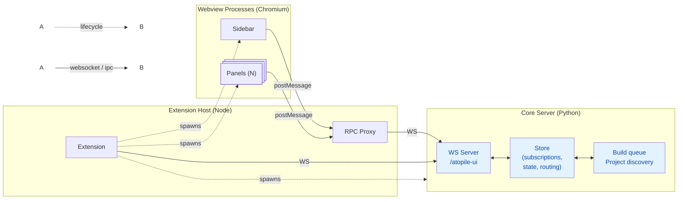

# Extension Architecture Rewrite: Merge Hub into Core, RPC Transport Layer

## Context

The current extension uses a 3-process architecture: VS Code extension host spawns a Node.js "Hub" process and a Python "Core Server" process. Webviews connect to the Hub via WebSocket, and the Hub relays to Core via a second WebSocket. This creates unnecessary complexity (two WS hops, a whole Node process just for state routing) and doesn't work for VS Code Remote SSH / Web IDE where webviews can't open direct WebSocket connections to localhost.

**Goals:**
1. Eliminate the Hub process — move its Store + subscription tracking + action routing into the Python core server
2. Introduce a proper RPC protocol layer with a pluggable transport underneath
3. Webviews **always** communicate through the extension host (never direct WS to core)
4. Implement VS Code `postMessage` transport now; stub WebSocket transport for future non-VS Code use

## New Architecture



**Key differences from current:**
- No Hub process — Core Server owns the Store, subscriptions, and action routing
- Webviews **never** connect directly to core — all traffic goes through the extension host via `postMessage`
- Extension host acts as RPC proxy: webview `postMessage` ↔ WebSocket to core (one WS per webview)
- Extension host also has its own WS connection for extension-level actions (`resolverInfo`, `setActiveFile`, etc.)

## Layered Protocol Design

```
┌─────────────────────────────────┐
│  RPC Protocol                   │  subscribe / state / action messages
│  (JSON, same as current)        │  unchanged semantics
├─────────────────────────────────┤
│  Transport Layer (pluggable)    │  how messages move between processes
│  ├─ PostMessageTransport        │  ← implement now (webview ↔ extension host)
│  └─ WebSocketTransport          │  ← stub for future (non-VS Code use)
└─────────────────────────────────┘
```

The `subscribe`/`state`/`action` RPC protocol is **unchanged**. The transport layer is an abstraction that can carry these messages over different channels.

## Implementation Plan

### Phase 1: Python Store + Subscription Tracking

**Create** `src/atopile/server/store.py`:
- Port of the TS `Store` class (45 lines → ~50 lines Python)
- `get(key)`, `set(key, value)`, `merge(key, partial)` with deep-equality check via `json.dumps`
- `on_change: Callable[[str, Any], None]` callback for broadcasting
- Uses camelCase keys to match the wire protocol exactly
- Default state matches `StoreState` defaults from `types.ts`

**Modify** `src/atopile/server/websocket.py` — `CoreSocket`:
- Add `Store` instance and per-client subscription tracking (`dict[ServerConnection, set[str]]`)
- Handle `subscribe` message type in `handle_client` (currently only handles `action`)
- On subscribe: track keys, immediately send current state for each key
- Replace `broadcast_state()` with store-based broadcasting (only to subscribed clients)
- Add all hub-local action handlers to `_dispatch`:
  - `selectProject` → `store.merge("projectState", ...)` + auto-trigger `listFiles`
  - `selectTarget` → `store.merge("projectState", ...)`
  - `setActiveFile` → `store.merge("projectState", ...)`
  - `resolverInfo` → `store.merge("coreStatus", ...)`
  - `coreStartupError` → `store.merge("coreStatus", ...)`
  - `extensionSettings` → `store.merge("extensionSettings", ...)`
  - `updateExtensionSetting` → `store.merge("extensionSettings", ...)`
  - `updateLogCoreStatus` → `store.merge("coreStatus", ...)`
- Change existing core actions (`discoverProjects`, `getPackagesSummary`, etc.) to write to store instead of calling `broadcast_state` directly
- Build queue `_push_builds` writes to store: `self._store.set("currentBuilds", ...)` / `self._store.set("previousBuilds", ...)`
- Remove the "send builds on connect" behavior — clients subscribe and get current state via the subscription mechanism
- Accept connections on `/atopile-ui` path (keep `/atopile-core` for backward compat during migration)

**Modify** `src/atopile/server/server.py`:
- Update `websockets.serve()` to accept the `/atopile-ui` path
- Remove any path-specific routing if present

**Reference files:**
- `src/ui/hub/webviewWebSocketServer.ts:85-163` — all local action handlers to port
- `src/ui/hub/store.ts` — Store semantics to replicate

### Phase 2: RPC Transport Layer (TypeScript)

The transport layer is a simple interface that both sides (webview and extension host) implement. The RPC protocol messages (JSON with `type` field) ride on top.

**Create** `src/ui/shared/rpcTransport.ts` — transport interface + implementations:
```typescript
/** Abstract transport for RPC messages. */
export interface RpcTransport {
  /** Send a raw JSON string to the other side. */
  send(data: string): void;
  /** Called when a raw JSON string arrives. */
  onMessage: ((data: string) => void) | null;
  /** Called when the transport is ready. */
  onOpen: (() => void) | null;
  /** Called when the transport closes. */
  onClose: (() => void) | null;
  /** Shut down the transport. */
  close(): void;
}
```

**Create** `src/ui/webview/shared/postMessageTransport.ts` — webview-side `postMessage` transport:
- Implements `RpcTransport`
- `send(data)` → `vscode.postMessage({type: "rpc:send", data})`
- Listens on `window` message events:
  - `rpc:recv` → calls `onMessage`
  - `rpc:open` → calls `onOpen`
  - `rpc:close` → calls `onClose`

**Stub** `src/ui/shared/webSocketTransport.ts` — WebSocket transport (not used yet):
- Implements `RpcTransport` over a `WebSocket` / `SocketLike`
- Skeleton implementation for future non-VS Code scenarios
- Not wired up in this iteration

**Modify** `src/ui/shared/webSocketClient.ts` → rename to `src/ui/shared/rpcClient.ts`:
- Rename `WebSocketClient` → `RpcClient`
- Change constructor from `create: () => SocketLike` to `transport: RpcTransport`
- Wire `transport.onMessage` → parse and route (same logic as current `socket.onmessage`)
- Wire `transport.onOpen` → resubscribe + call `onConnected`
- Wire `transport.onClose` → call `onDisconnected` + reconnect logic
- Keep the reconnect scheduler but have it call a `reconnect()` callback (transport-level reconnect)
- Add `sendRaw(data: string)` method for the extension-side proxy
- Keep `subscribe()`, `sendAction()`, existing helpers

**Modify** `src/ui/webview/shared/webviewWebSocketClient.tsx` → rename to `src/ui/webview/shared/rpcClient.tsx`:
- Change `constructor(url: string)` → `constructor(transport: RpcTransport)`
- Change `connectWebview(hubUrl: string)` → `connectWebview(transport: RpcTransport)`
- Rename `hubConnected` → `connected`
- Uses `RpcClient` internally instead of `WebSocketClient`

**Modify** `src/ui/webview/shared/render.tsx`:
- Remove `__ATOPILE_HUB_PORT__` global
- Create `PostMessageTransport` instance
- Pass it to `connectWebview(transport)`

**Modify** `src/ui/webview/panel-logs/logWebSocketClient.ts`:
- Use the same `RpcTransport` instead of a separate direct WebSocket
- Log streaming (`subscribeLogs`/`unsubscribeLogs`) goes through the same RPC connection

**Modify** `src/ui/shared/types.ts`:
- Rename `hubConnected` → `connected` in `StoreState`
- Remove `hubCoreConnected` from `CoreStatus`

### Phase 3: Extension Host — RPC Proxy + Core Client

The extension host is the **sole bridge** between webviews and core. Every webview gets its own WS connection to core, proxied through `postMessage`.

**Create** `src/vscode-atopile/src/rpcProxy.ts`:
- `RpcProxy` class, implements `vscode.Disposable`
- `constructor(corePort: number)`
- `registerWebview(webview: vscode.Webview): vscode.Disposable`
  - Creates a new WS connection to `ws://localhost:{corePort}/atopile-ui`
  - Listens on `webview.onDidReceiveMessage` for `rpc:send` → forwards raw data to WS
  - Listens on WS messages → sends `{type: "rpc:recv", data}` via `webview.postMessage()`
  - On WS open → sends `{type: "rpc:open"}` to webview
  - On WS close → sends `{type: "rpc:close"}` to webview; schedules reconnect
  - Returns a `Disposable` that cleans up the WS + listener

**Create** `src/vscode-atopile/src/coreClient.ts` (replaces `hubWebSocketClient.ts`):
- Same pattern as `HubWebSocketClient` but connects to `/atopile-ui` on core port
- Uses the existing shared `WebSocketClient` (Node `ws` library) for the extension's own connection
- Sends `resolverInfo`, `extensionSettings`, `setActiveFile`, `discoverProjects`
- Subscribes to `extensionSettings` for two-way VS Code config sync

**Modify** `src/vscode-atopile/src/extension.ts`:
- Remove `startHub()` — no hub process
- Remove `hubPort` / second `findFreePort()` call
- Create `RpcProxy(coreServerPort)` — always (not optional)
- After core server starts, connect `CoreClient` to core
- Send `discoverProjects` with workspace folders on connect
- Pass `RpcProxy` to `WebviewManager`

**Modify** `src/vscode-atopile/src/webviewManager.ts`:
- Remove `_hubPort` constructor param, remove `__ATOPILE_HUB_PORT__` from HTML
- Accept `RpcProxy` in constructor
- In `resolveWebviewView` and `openPanel`: call `proxy.registerWebview(webview)` and push disposable
- Existing `_registerMessageHandler` continues handling `log`, `openPanel`, `openFile`, etc. (coexists with `rpc:*` messages on the same `onDidReceiveMessage`)

### Phase 4: Cleanup

**Delete** entire `src/ui/hub/` directory:
- `main.ts`, `store.ts`, `webviewWebSocketServer.ts`, `coreWebSocketClient.ts`, `utils.ts`, `package.json`, `tsconfig.json`

**Move** `findFreePort()` from `src/ui/hub/utils.ts` → `src/vscode-atopile/src/utils.ts` (only remaining consumer)

**Delete** `src/vscode-atopile/src/hubWebSocketClient.ts`

**Rename/delete** old files replaced by new ones:
- `src/ui/shared/webSocketClient.ts` → replaced by `rpcTransport.ts` + `rpcClient.ts` (or refactored in-place)
- `src/ui/webview/shared/webviewWebSocketClient.tsx` → replaced by `rpcClient.tsx`

**Update** build scripts:
- Remove hub build step from `package.json` / build config
- Remove hub-dist from extension packaging

**Update** all webview components referencing `hubConnected` → `connected`

### Phase 5: Update Architecture Doc

**Rewrite** `src/EXTENSION_ARCHITECTURE.md` with the new diagram and protocol description.

## Key Design Decisions

1. **Webviews never connect directly to core.** All webview traffic goes through the extension host via `postMessage`. The extension host holds per-webview WS connections to core. This works universally — local, SSH remote, web IDE.

2. **RPC protocol layer is separate from transport.** The `subscribe`/`state`/`action` JSON protocol is the RPC layer. The transport (`RpcTransport` interface) is pluggable underneath. We implement `PostMessageTransport` now; `WebSocketTransport` is stubbed for future non-VS Code use.

3. **One WS per webview in the proxy** (not multiplexed): simpler, matches per-client subscription model in core, avoids fan-out complexity.

4. **`rpc:` prefix for proxy messages** (`rpc:send`, `rpc:recv`, `rpc:open`, `rpc:close`): clearly separated from existing webview `postMessage` types (`log`, `openPanel`, `openFile`, etc.). Both handlers coexist on `webview.onDidReceiveMessage`.

5. **Store uses camelCase keys** matching the TypeScript `StoreState`: the wire protocol sends these keys directly and the webview expects camelCase.

6. **`broadcast_state` becomes subscription-aware**: only sends to clients that subscribed to the changed key (port of Hub's `broadcastChange`).

## Verification

1. **End-to-end**: Start extension locally, verify sidebar/panels load, build works, all tabs (files, packages, parts, stdlib, structure, params, BOM) populate correctly — all traffic flowing through the postMessage proxy
2. **Reconnection**: Kill and restart core server — verify the proxy reconnects WS and webviews recover state
3. **Subscription filtering**: Add console logging in Python store to verify only subscribed clients receive state updates
4. **Extension settings sync**: Change settings in VS Code config, verify they propagate to core and back
5. **Build queue**: Start a build, verify `currentBuilds`/`previousBuilds` update in real-time
6. **Log streaming**: Open logs panel, verify log streaming works through the main `/atopile-ui` endpoint
7. **No hub process**: Verify no Node hub process is spawned, only the core server Python process
