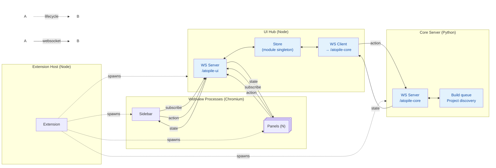

# Extension Architecture

## WebSocket Protocol

All communication uses JSON messages with a `type` field.

### Message Types

| Type | Direction | Purpose |
|------|-----------|---------|
| `subscribe` | Webview → Hub | Register interest in store keys (e.g. `core_status`, `project_state`) |
| `action` | Webview → Hub → Core | Trigger an operation (e.g. `start_build`, `select_project`) |
| `state` | Core → Hub → Webview | Push updated state slices to subscribers |

### Endpoints

- `/atopile-ui` — Hub WS server, accepts webview connections
- `/atopile-core` — Core server WS endpoint, hub connects as a client

## Startup Sequence

1. Extension assigns free ports for hub and core server
2. Hub (Node) starts, opens WS server on `/atopile-ui`
3. Extension registers sidebar + panel webviews (immediately available)
4. Core server (Python, `ato serve core`) starts, opens WS on `/atopile-core`
5. Hub connects to core server, sends `discover_projects` action
6. Webviews connect to hub, subscribe to store keys, receive state updates
