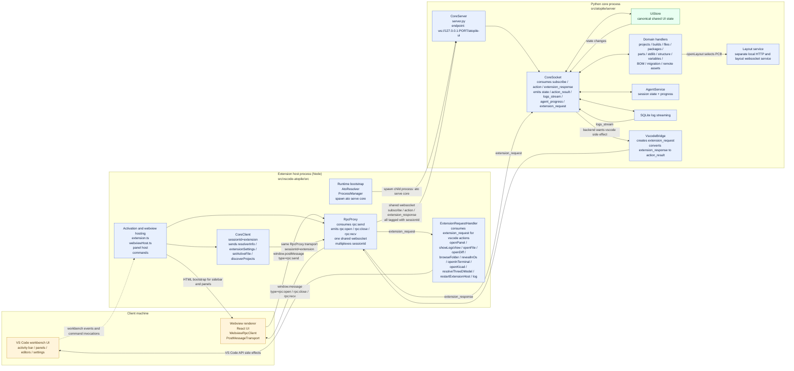

# VS Code Extension Architecture

Active rewrite-native runtime only:

- Extension host runtime: `src/vscode-atopile/src`
- Webview UI source: `src/ui/webview`
- Shared RPC/types: `src/ui/shared`
- Python core runtime: `src/atopile/server`, `src/atopile/agent`, `src/atopile/layout_server`

Key invariants:

- Webviews only talk to the extension host through `rpc:*` postMessage events.
- The extension host keeps one shared websocket open to the Python core at
  `ws://127.0.0.1:<port>/atopile-ui`.
- Webview traffic and extension-owned traffic are multiplexed on that socket by
  `sessionId`.
- The canonical shared UI state lives in the backend `UiStore`.
- Backend work that needs VS Code APIs round-trips back through
  `extension_request` / `extension_response`.

Notes:

- This diagram shows the normal extension runtime path. It does not show the
  old `src/ui-server` path because that is not part of the active rewrite.
- `panel-layout` is the main intentional side channel: the panel still uses the
  main RPC path to choose the PCB, then embeds the separate local layout
  service.
