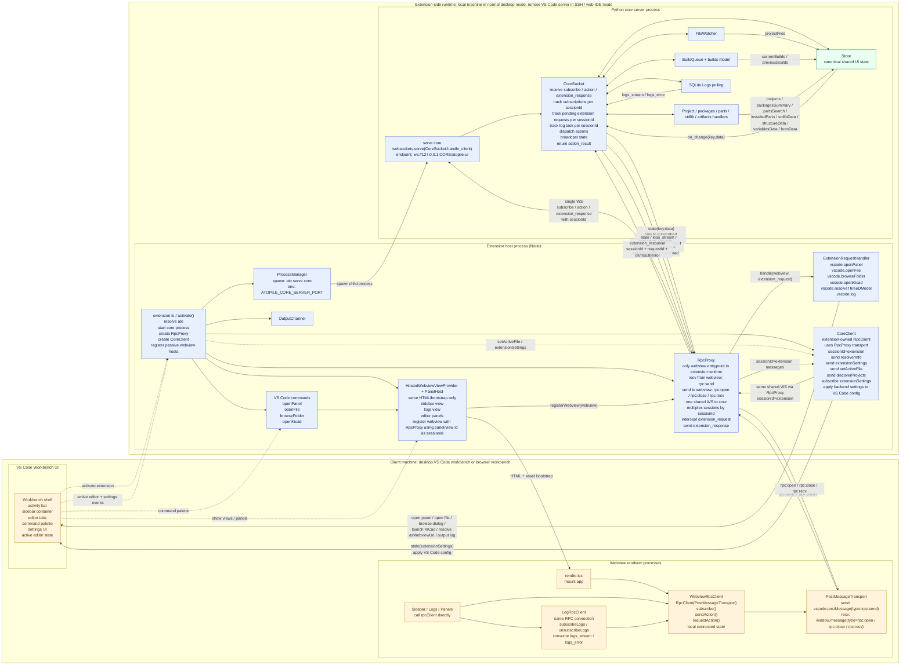

# VS Code Extension Architecture

Key invariants:

- webviews only talk through RPC
- core interprets every webview-originated action first
- extension-only work returns from core as `extension_request`
- VS Code-coupled backend actions live under the `vscode.*` RPC namespace
- there is exactly one extension-to-core IPC socket
- webview and extension sessions are multiplexed over that socket via `sessionId`
- there is no direct webview command channel into the extension host

## Boundary Meaning

`VS Code Workbench UI` is the host application shell: the activity bar, editor tabs, command palette, settings UI, and the active-editor state that the extension observes through the VS Code API.

It is not the same thing as either of these:

- `Extension host process`: the Node process running the extension code and owning the VS Code extension API surface.
- `Webview renderer processes`: isolated browser documents/processes used to render the sidebar, logs view, and editor panels.

So the workbench box is there to show where user-visible UI and VS Code-owned events live, while the extension host and webviews are the programmable runtimes attached to that shell.

## Placement In Remote Modes

In normal desktop VS Code:

- client machine runs the workbench UI, webview renderers, extension host, and Python core server

In Remote SSH, Codespaces, or similar web-IDE/server-backed modes:

- client machine runs the workbench UI and webview renderers
- backend VS Code server runs the extension host and Python core server

That is the main reason the diagram is split into `Client machine` and `Extension-side runtime`: the left side always stays with the user, while the right side may be local or remote depending on how VS Code is being used.

## Notes

- `connected` is local webview state derived from `rpc:open` / `rpc:close`; it is not stored in Python.
- panel/view ids are the logical `sessionId`s used for multiplexing webview traffic on the shared extension-to-core socket.
- `updateExtensionSetting` still goes through core first: webview action -> backend store -> `CoreClient` subscription -> VS Code config update.
- Logs share the same proxied RPC connection as the rest of the logs panel.
- VS Code-coupled backend routing lives in [`src/atopile/server/domains/vscode_bridge.py`](/home/ra/git/atopile/src/atopile/server/domains/vscode_bridge.py).
