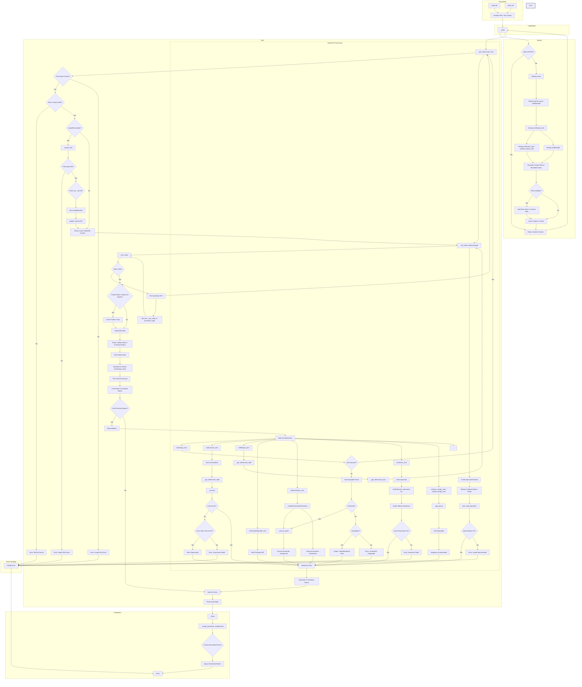

# Atopile Parser

This directory contains the ANTLR grammar files (`.g4`), the generated Python parser code, and utilities related to parsing `.ato` files.

## `front_end.py` Workflow

The `front_end.py` module is responsible for taking the Abstract Syntax Tree (AST) generated by the parser and constructing the corresponding Faebryk object graph. It uses two main visitor classes: `Wendy` for initial surveying and `Bob` for building the graph.

## Installing ANTLR

1. Make sure you're running native brew (an issue if you're on OSx with Rosetta - because you mightn't notice)
2. Install java
3. `pip install antlr4-tools`

I thiiiiink that should work, but it was a bit of a PITA and there's a chance I missed something.

## Building this

cd to the `src/atopile/parser` directory and run the following command:

`antlr4 -visitor -no-listener -Dlanguage=Python3 AtoLexer.g4 AtoParser.g4`

