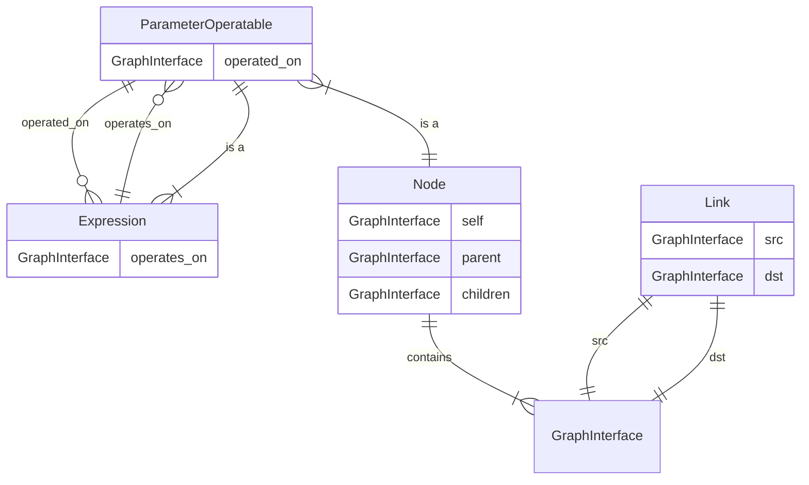
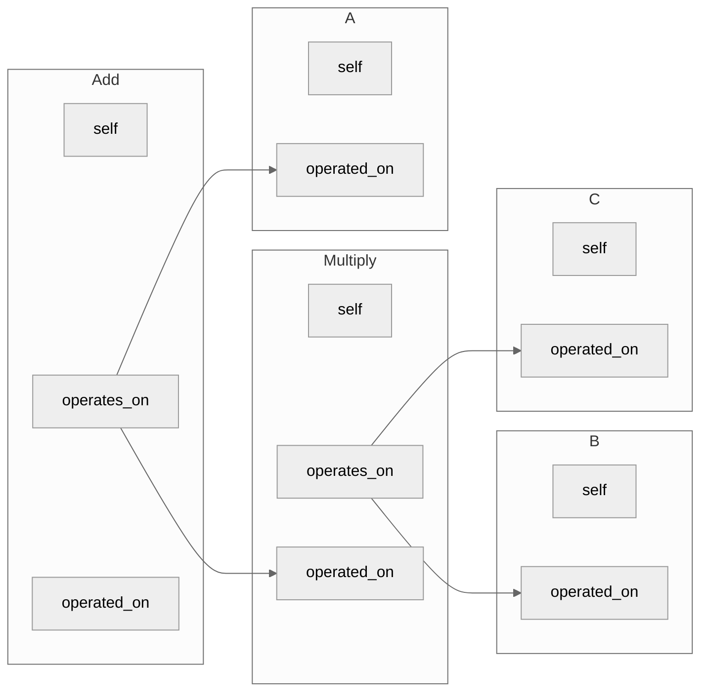

# :alembic: Rum is technically a solution - An overview of the parameter subsystem

> "The solver doesn't bite, but it will hurt you in different ways." - Ioannis P

## Covered topics with links
- literals - `Sets` - [libs/sets](../../libs/sets)
    - `Numeric`, `Quantities`
    - `Boolean`
    - `Enums` 
- correlation in set algebra
    - literal correlation
    - `Expression` congruency
- symbols - `ParameterOperatables` - [core/parameter.py](../../core/parameter.py)
    - `Parameters`
    - `Expressions`
    - `ConstrainableExpressions`
    - compact representation
    - `IsSubset`, `IsSuperset`, `Is`
- data structures
    - `Expression` trees
    - the `Graph` - [core/cpp/graph api](../../core/cpp/__init__.pyi)
    - `Mutator` - [core/solver/mutator.py](../solver/mutator.py)
- canonicalization
- picking parts - [libs/picker.py](../../libs/picker/picker.py)
- solving - [core/solver](../..//core/solver)
    - computer algebra - symbolic solving
    - constraint solving
    - numerical solving: WIP
- optimization: WIP


## Introduction
Parameters express attributes of a module that exist in numeric, boolean or enum domains. Consider a basic resistor example:
```ato
# ato
module Resistor:
    resistance: Ohm
    rated_power: W
```
```python
# fab ll
class Resistor(Module):
    resistance = L.p_field(
        unit=P.Ohm, 
        domain=L.Domains.Numbers.REAL(negative=False),
    )
    rated_power = L.p_field(
        unit=P.W,
        domain=L.Domains.Numbers.REAL(negative=False),
    )
```
What distinguishes parameters from construction arguments is that they can be defined later and determined implicitly through constraints.

```ato
psu = new PowerSupply
resistor = new Resistor
assert resistor.resistance within 100kOhm +/- 10%
assert resistor.rated_power >= psu.voltage * psu.max_current
```

These assertions serve two purposes: they verify design consistency and communicate relationships to the core system. This information enables automatic part selection for modules without explicitly defined components.

## Literals

The syntax `100kOhm +/- 10%` in the example above specifies a resistance within a range. This notation is common in atopile because real-world components rarely have exact values due to manufacturing tolerances and environmental factors like temperature.

*Important: Ensure all parameters share the same context. For example, a `5V +/-10%` power supply voltage could be interpreted as either a range from `4.5V` to `5.5V`, or from `0V` to `5.5V` if considering power-up states. Generally, choose the most comprehensive context (including startup conditions), but be aware that many engineering calculations focus on specific operating points to simplify analysis.*

These non-variable values are called **literals** and are implemented as `Sets`. For example, `100kOhm +/- 10%` represents a set containing all real numbers between `90e3` and `110e3` Ohms. Sets are more flexible than simple intervals or single values (`100kOhm` exactly), and can represent numeric values with units, booleans, and enums.

Literals support arithmetic operations:
```python
Range(100*P.W, 200*P.W) * 2
-> Range(200*P.W, 400*P.W)

Range(100*P.W, 200*P.W) + 10*P.W
-> Range(110*P.W, 210*P.W)

Range(100*P.W, 200*P.W) + Range(10*P.W, 20*P.W)
-> Range(110*P.W, 220*P.W)
```

Let's examine the last example more closely. When adding two intervals (which are special cases of sets), the result is a new interval encompassing all possible values from both sets. This principle applies to any operation between sets.

Mathematically, this is expressed as:
$$ 
\begin{aligned}
    \forall S \in \mathcal{P}, \forall X,Y \subseteq S, f: S \times S \to S : f(X,Y) := \{ f(x,y) \mid x \in X, y \in Y \}
\end{aligned}
$$
In simpler terms: When applying a function to sets, we compute the function for every possible combination of elements from both sets and collect all results into a new set. This principle extends beyond just real numbers.

This definition leads to an interesting case:

```python
X = Range(10*P.W, 20*P.W)
X - X
-> Range(-10*P.W, 10*P.W)
```

However:
```python
X = Range(10*P.W, 10*P.W) # aka Single(10*P.W)
X - X
-> Range(0*P.W, 0*P.W) # aka Single(0*P.W)
```

This reveals two key principles:
> Singleton sets are self-correlated
> All other sets are uncorrelated with any other set (including themselves)

Since literals are implemented as sets, any non-singleton literal is uncorrelated with itself.

Set arithmetic exhibits some interesting properties. For example:
```python
Range(10, 20) / Range(-1, 1)
-> Range(-10, inf) # because lim(y->0) (x/y) = inf
```

## Symbols

To express correlations between values, we use symbols:
```python
X = Range(10*P.W, 20*P.W)
A = Parameter()
A.alias_is(X)
E = A - A
out, = DefaultSolver().simplify_symbolically(E)
out[E]
-> Single(0*P.W)
```

This introduces `ParameterOperatables`, specifically `Parameters` (like A in this example) and `Expressions` (like E). Parameters are similar to mathematical variables rather than programming variables. Expressions consist of an operation and a list of operands, where operands can be literals or ParameterOperatables. This allows nested expressions like `Multiply(Add(A, B), C)`.

Expressions use operator overloading for intuitive syntax:
```python
A + B
-> Add(A, B)
A + B * C
-> Add(A, Multiply(B, C))
```

Expressions that produce Boolean outputs can be constrained, and we call these `ConstrainableExpressions`:
```python
# unconstrained
A >= B
-> GreaterOrEqual(A, B)

# constrained
(A >= B).constrain()
-> GreaterOrEqual(A, B)
A.constrain_ge(B)
-> GreaterOrEqual(A, B)
```

Most expressions don't create correlations between ParameterOperatables, with one important exception: the `Is` expression. When constrained, `Is` creates a complete correlation between its operands:

```python
Is(A, B).constrain()
# or
A.alias_is(B)

E = A - B
out, = DefaultSolver().simplify_symbolically(E)
out[E]
-> Single(0*P.W)
```

Expression representations can become lengthy and hard to read. For this reason, we provide a more mathematical notation through compact representation:

```python
E = A + B * C
-> Add(A, Multiply(B, C))
E.compact_repr()
-> A + (B * C)

(A >= B).constrain().compact_repr()
-> A >=! B

A.alias_is(Range(18*P.W, 22*P.W))
B.constrain_subset(Range(27*P.W, 33*P.W))
A.constrain_le(B).compact_repr()
-> A{I|[20W ±10%]} <=! B{S|[30W ±10%]}
```

Constrained `Is` and `IsSubset` expressions with literals play a special role in our parameter system. Since literals cannot be correlated, they're typically used with Parameters through `alias_is`. In practical designs, `constrain_subset` & `constrain_superset` (in fabll) or `assert within` (in ato) are the most common expressions because they explicitly define parameter bounds.

```python
# This resistor's resistance must always be between 90kOhm and 110kOhm
# A narrower range (e.g., 103kOhm ±1%) is acceptable
resistor.resistance.constrain_subset(
    Range.from_center_rel(100*P.kOhm, 10*P.percent)
)

# This LDO must handle any voltage from 10.8V to 13.2V
# It may accept voltages outside this range as well
ldo.input_voltage.constrain_superset(
    Range.from_center_rel(12*P.V, 10*P.percent)
)

# CAUTION: This requires a resistor with exactly 10% tolerance
# A 100kOhm ±5% resistor would not satisfy this constraint
# Using alias_is with literals is rarely appropriate in designs
resistor.resistance.alias_is(
    Range.from_center_rel(100*P.kOhm, 10*P.percent)
)
```

## Data Structures

The core system models everything as a graph, including the parameter system. Here's a summary of the core graph components:

- `GraphInterface`: The vertices of the graph
- `Link`: The edges of the graph
- `Node`: Higher-level vertex containing multiple GraphInterfaces
    - Contains a `self` GraphInterface that maps between high-level and low-level graph spaces
    - Contains `parent` and `children` GraphInterfaces that create a tree structure

These components are used to implement:
- `Module`: A `Node` representing design modules (like components)
- `ModuleInterface`: A `Node` with a `connected` `GraphInterface` for high-level Module connections
    - Example: `Electrical` is a `ModuleInterface` that connects to other `Electrical` `ModuleInterface`s
- `ParameterOperatable`: A `Node` within the parameter system
    - Contains an `operated_on` `GraphInterface` allowing Expression connections
- `Expression`: A `ParameterOperatable`
    - Contains an `operates_on` `GraphInterface` linking to `ParameterOperatable` operands



As shown above, a `ParameterOperatable` is implemented as a `Node` within our high-level graph. Expression trees are built within this graph space. For example, the expression `A + B * C` creates this graph structure:



Graphs are append-only, meaning edges and vertices cannot be removed. This creates a challenge when modifying expressions within the solver. For example, simplifying `A + 5 + 3` to `A + 8` isn't straightforward without using the `Mutator`. 

The `Mutator` provides functions that help modify a Graph by creating a new Graph with the desired changes:

```python
E0 = Multiply(A, B)
E1 = Add(E9, 5)
E2 = Add(E1, 3)
-> Add(Add(Multiply(A, B), 5), 3)

# ... mutate and transform ...

E3_mutated
-> Add(Multiply(A_mutated, B_mutated), 8)
E0_mutated
-> Multiply(A_mutated, B_mutated)

E0_mutated is E0
-> False

# E1_mutated and E2_mutated don't exist
# E0, E1, E2, E3, A, B remain unchanged in the old graph
A.get_graph() is A_mutated.get_graph()
-> False
```

## Canonicalization
In previous examples, we used float literals like `5` and `3`, which aren't strictly literals according to our earlier definition. For user convenience, we accept non-canonical literals and convert them before processing in the solver.

We canonicalize values in these ways:
- Numeric values (with or without units) become `Quantity_Interval_Disjoint`
    - Values without units get the `dimensionless` unit
    - Float/int values become `Singleton` (a special case of `Quantity_Interval_Disjoint`)
    - Range/Quantity_Interval values become `Quantity_Interval_Disjoint` with a single interval
- Boolean literals become `BoolSet`
- Enum literals become `EnumSet`
- Non-canonical expressions become canonical expressions
    - `A - B` becomes `A + (B * -1)`
    - `A / B` becomes `A * (B ^ -1)`
    - `A ∧ B` becomes `¬(¬A ∨ ¬B)`

```python
CanonicalNumericExpression = Add | Multiply | Power | Round | Abs | Sin | Log
CanonicalLogicExpression = Or | Not
CanonicalSeticExpression = Intersection | Union | SymmetricDifference
CanonicalPredicate = GreaterOrEqual | IsSubset | Is | GreaterThan
```

## Picking Parts
The system uses constraints on module parameters to identify suitable components. Here's a simple example:
```ato
# ato
assert resistor1.resistance within 100kOhm +/- 10%
assert resistor1.rated_power >= 0.1W

# This might result in selecting a 100kOhm ±1% resistor rated for 1W
```

Often, parameter constraints are more complex and interconnected:
```ato
assert resistor2.resistance within resistor1.resistance * 10
```

In such cases, modules become interdependent, making part selection more challenging. The picking process follows these steps:
- Solver: Symbolically simplify the constraint system
- Solver: Generate upper bounds for each relevant parameter
- Backend: Query the picker backend for parts within these bounds
- Solver: Verify that candidate combinations satisfy all constraints

To manage the combinatorial complexity of this search, we employ several strategies:
- Calculate parameter bounds before any picking
- Validate single-candidate modules first
- Attempt to pick all parts simultaneously using first candidates
- Fall back to sequential picking if simultaneous picking fails

## Solving
Constraint solving is fundamental to atopile's operation. It enables part picking, design verification, abstraction, modularity, collaboration, and code reuse. While essential, it's also computationally challenging due to the large number of constraints in typical designs.

The solver combines constraint solving with computer algebra and (planned) optimization. It operates in these theoretical stages:
 1. Non-terminal canonicalization
 2. Non-terminal symbolic solving
 3. Terminal symbolic solving
 4. Terminal symbolic optimization
 5. Terminal numerical solving
 6. Terminal numerical optimization

Currently, only phases 1-3 are implemented, which suffice for most needs. Phases 2 and 3 are currently combined.

"Terminal" means the solver can assume no new constraints will be added:
```
A, B = Parameter(), Parameter()
(A >= B).constrain()

# non-terminal: no action possible

# terminal
# Since A and B are unconstrained, we can satisfy A >= B
# by setting them equal, so we can conclude (A>=B) is True
```

Phases 2/3 iterate through available `algorithms` until no algorithm produces changes in an iteration.

Most symbolic algorithms are in [symbolic/](../../core/solver/symbolic/). The `idempotent_deduplicate` algorithm provides a good starting point for understanding the system.

## Optimization - WIP
When working with a specification like `100kOhm +/-10%`, multiple optimization goals are possible:
- Minimize component cost
- Minimize tolerance range
- Minimize deviation from nominal value
- And more...

Since optimal choices depend on design requirements, we need a way to express these preferences through cost functions.
