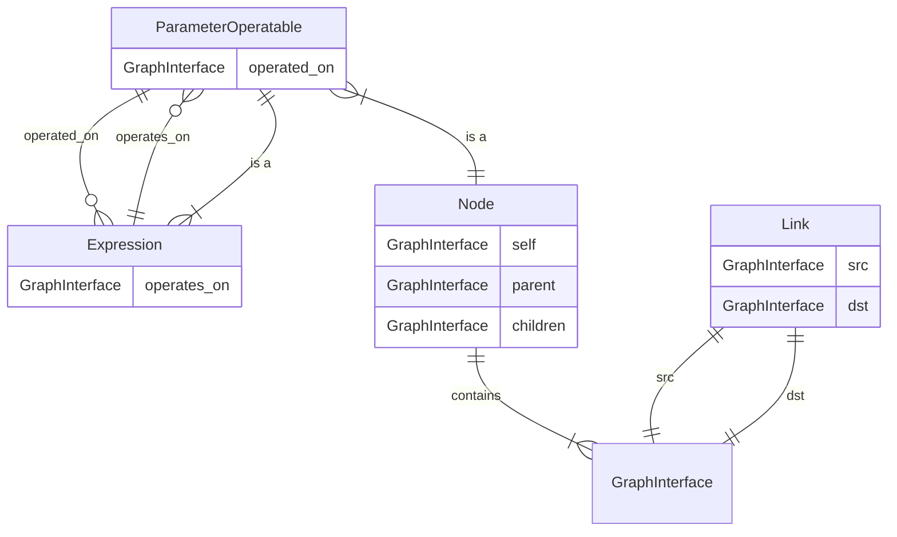
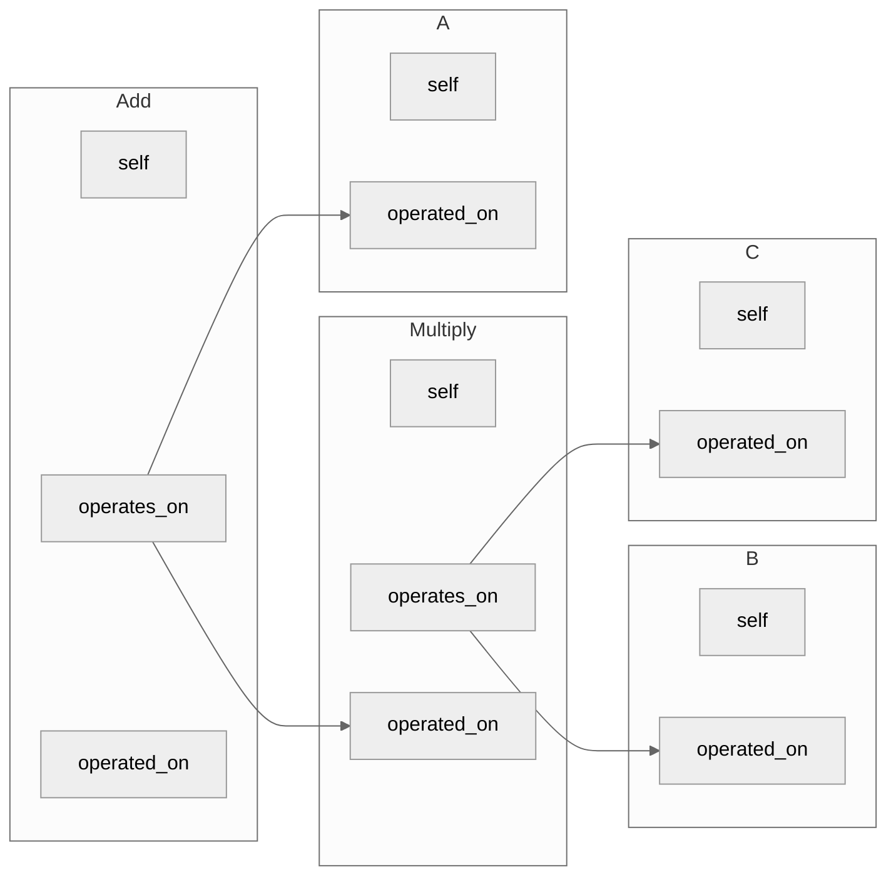

# :alembic: Rum is technically a solution - An overview of the parameter subsystem

> The solver doesn't bite, but it will hurt you in different ways. - Ioannis P

## Covered topics with links
- literals - `Sets` - [libs/sets](../../libs/sets)
    - `Numeric`, `Quantities`
    - `Boolean`
    - `Enums` 
- correlation in set algebra
    - literal correlation
    - `Expression` congruency
- symbols - `ParameterOperatables` - [core/parameter.py](../../core/parameter.py)
    - `Parameters`
    - `Expressions`
    - `ConstrainableExpressions`
    - compact representation
    - `IsSubset`, `IsSuperset`, `Is`
- data structures
    - `Expression` trees
    - the `Graph` - [core/cpp/graph api](../../core/cpp/__init__.pyi)
    - `Mutator` - [core/solver/mutator.py](../solver/mutator.py)
- canonicalization
- solving - [core/solver](../..//core/solver)
    - computer algebra - symbolic solving
    - constraint solving
    - numerical solving: WIP
- picking parts - [libs/picker.py](../../libs/picker/picker.py)
- optimization: WIP


## Introduction
We are using parameters to express some form of attribute of a module that is within the numeric, boolean or enum domain. Think of a very simple resistor
```ato
# ato
module Resistor:
    resistance: Ohm
    rated_power: W
```
```python
# fab ll
class Resistor(Module):
    resistance = L.p_field(
        unit=P.Ohm, 
        domain=L.Domains.Numbers.REAL(negative=False),
    )
    rated_power = L.p_field(
        unit=P.W,
        domain=L.Domains.Numbers.REAL(negative=False),
    )
```
What sets parameters apart from construction arguments is their ability to be defined at a *later time* and *implicitly through a set of constraints*.

```ato
psu = new PowerSupply
resistor = new Resistor
assert resistor.resistance within 100kOhm +/- 10%
assert resistor.rated_power >= psu.voltage * psu.max_current
```

These assertions not only ensure that the design is consistent but it also communicates relationships and constrains to the core. Those can be then used to automatically pick parts for modules that have no explicit parts defined.

## Literals

You might have noticed that in the example above we used the syntax `100kOhm +/- 10%` to express that the resistance has to be within a certain range. This is a very typical way to denote values in atopile because most things in the real world are not exact. This can be due to manufacturing tolerances or fluctuations caused by unpredicatable external factors (e.g temperature).
*Important: Make sure that all parameters live in the same environment:
e.g is the voltage of a `6V +/-10%` power supply a subset of `4.5V` to `5.5V` or a subset of `0V` to `5.5V` because the power supply might be off that fully depends on the perspective (environment) of a design. Most often one should choose for the most general case which would include the ramping up from 0V to the nominal voltage. But in real a lot of engineering is done around a specific fixpoint/state of a system to optimize engineering time.*

We call those non-variable containing values **literals**.
They are represented as `Sets`. `100kOhm +/- 10%` is just a set that contains all real numbers between `90e3` and `110e3` with a unit of `Ohm`. Sets are thus more general than intervals or singletons (`100kOhm` exactly). 
Literals are in the most cases some form of set of real numbers with a unit, but we also support sets of booleans and enums.

```python
class Capacitor(Module):
    class TemperatureCoefficient(Enum):
        Y5V = auto()
        Z5U = auto()
        X7S = auto()
        X5R = auto()
        X6R = auto()
        X7R = auto()
        X8R = auto()
        C0G = auto()

    temperature_coefficient = L.p_field(
        domain=L.Domains.ENUM(TemperatureCoefficient),
    )

```

We can do arithmetic with literals
```python
Range(100*P.W, 200*P.W) * 2
-> Range(200*P.W, 400*P.W)

Range(100*P.W, 200*P.W) + 10*P.W
-> Range(110*P.W, 210*P.W)

Range(100*P.W, 200*P.W) + Range(10*P.W, 20*P.W)
-> Range(110*P.W, 220*P.W)
```

Let's take a second to have a closer look at the last example.
Apparently if you add two intervals (special case of sets) you get a new interval that covers all possible values of the two sets. This is the case for any operation between two sets.


$$ 
\begin{aligned}
    \forall S \in \mathcal{P}, \forall X,Y \subseteq S, f: S \times S \to S : f(X,Y) := \{ f(x,y) \mid x \in X, y \in Y \}
\end{aligned}
$$
*In simple words: We define an elementwise function applied to sets as the set of all combinations of the function applied to any element of the first set and any element of the second set.*
Note: This extends also beyond the Real domain.

This definition brings us to an interesting case:

```python
X = Range(10*P.W, 20*P.W)
X - X
-> Range(-10*P.W, 10*P.W)
```

But:
```python
X = Range(10*P.W, 10*P.W) # aka Single(10*P.W)
X - X
-> Range(0*P.W, 0*P.W) # aka Single(0*P.W)
```

Basically, our definition results in:
> Singletons are auto-correlated
> Every other set is fully uncorrelated to any other set

And since our literals are all sets, any literal is uncorrelated to itself.

There are some interesting patterns in set arithmetic that we won't go into here.
But good to see an example:
```python
Range(10, 20) / Range(-1, 1)
-> Range(-10, inf) # due to lim(y->0) (x/y) = inf
```

## Symbols

Well, so how can we express correlations then?
```python
X = Range(10*P.W, 20*P.W)
A = Parameter()
A.alias_is(X)
E = A - A
out, = DefaultSolver().simplify_symbolically(E)
out[E]
-> Single(0*P.W)

```

A lot is happening here, but the important bit is our symbols or as we call them `ParameterOperatables`. Here the more specific `Parameters` (A in this example) and `Expressions` (E in this example).
Parameters are very closely related to how we think of variables in math, but not variables in programming.
Expressions are a tuple of an operation and a list of operands. Operands can be literal or ParameterOperatables.
Thus expressions can take expressions as operands too `Multiply(Add(A, B), C)`.
Expressions use operator overloading.

```python
A + B
-> Add(A, B)
A + B * C
-> Add(A, Multiply(B, C))
```

Expressions with the output domain of 'Boolean' can be constrained. We refer to those as `ConstrainableExpressions`.
```python
# unconstrained
A >= B
-> GreaterOrEqual(A, B)

# constrained
(A >= B).constrain()
-> GreaterOrEqual(A, B)
A.constrain_ge(B)
-> GreaterOrEqual(A, B)
```

We have mentioned further up correlations. All (except one) expressions are non-correlating.
That means that two ParameterOperatables are not getting correlated by an expression.
Except for the one special case: `Is`
A constrained `Is` expression creates a full correlation between its operands.

```python
Is(A, B).constrain()
# or
A.alias_is(B)

E = A - B
out, = DefaultSolver().simplify_symbolically(E)
out[E]
-> Single(0*P.W)
```

The full repr of Expressions can get quite long and difficult to read for humans.
That's why there is a more math-like representation of Expressions:

```python
E = A + B * C
-> Add(A, Multiply(B, C))
E.compact_repr()
-> A + (B * C)

(A >= B).constrain().compact_repr()
-> A >=! B

A.alias_is(Range(18*P.W, 22*P.W))
B.constrain_subset(Range(27*P.W, 33*P.W))
A.constrain_le(B).compact_repr()
-> A{I|[20W ±10%]} <=! B{S|[30W ±10%]}
```

The last example shows that constrained `Is` and `IsSubset` expressions with literals have quite a special place in our parameter system. Since literals can not be correlated, they are mostly used in the form of Parameters that are `alias_is`'ed to a literal. In the design space `constrain_subset` & `constrain_superset` (fabll) or `assert within` (ato) are the most common expressions, because they express an explicit value for a parameter.

```python

# we need a resistor who's resistance always resides between 90kOhm and 110kOhm
# it's fine if it is more narrow (e.g 103kOhm +/-1%)
resistor.resistance.constrain_subset(
    Range.from_center_rel(100*P.kOhm, 10*P.percent)
)

# we need an ldo that can handle everything from 10.8V to 13.2V
# it's okay if it also accepts other voltages
ldo.input_voltage.constrain_superset(
    Range.from_center_rel(12*P.V, 10*P.percent)
)

# CAREFUL! This will require a resistor that has a tolerance of exactly 10%
# Thus a 100kOhm +/-5% resistor will not work
# In general, very unlikely in design space to use alias_is with literals
resistor.resistance.alias_is(
    Range.from_center_rel(100*P.kOhm, 10*P.percent)
)
```

## Data Structures

Everything in the core is modeled as a graph. That also applies to the parameter system.
Little summary of the core graph:

- `GraphInterface` - The vertices of the graph
- `Link` - The edges of the graph
- `Node` - Higher level vertex which contains multiple GraphInterfaces
    - contains `self` GraphInterface that creates a mapping between the high-level and low-level graph space
    - contains `parent` and `children` GraphInterfaces that are used to create a tree structure

Those are then used by:
- `Module` - `Node` that represents modules (e.g a component) in the design
- `ModuleInterface` - `Node` that contains `connected` `GraphInterface` to create high-level connections between Modules
    - e.g `Electrical` is a `ModuleInterface` that connects to other `Electrical` `ModuleInterface`s
- `ParameterOperatable` - `Node` within the parameter system
    - contains `operated_on` `GraphInterface` that allows Expressions to link to it
- `Expression` - `ParameterOperatable`
    - contains `operates_on` `GraphInterface` that links to `ParameterOperatable` operands




Here we can already see that a `ParameterOperatable` is just a `Node` within our high-level graph.
And we build our Expression tree just within the graph space.
For the example of `A + B * C` we get the following graph:



