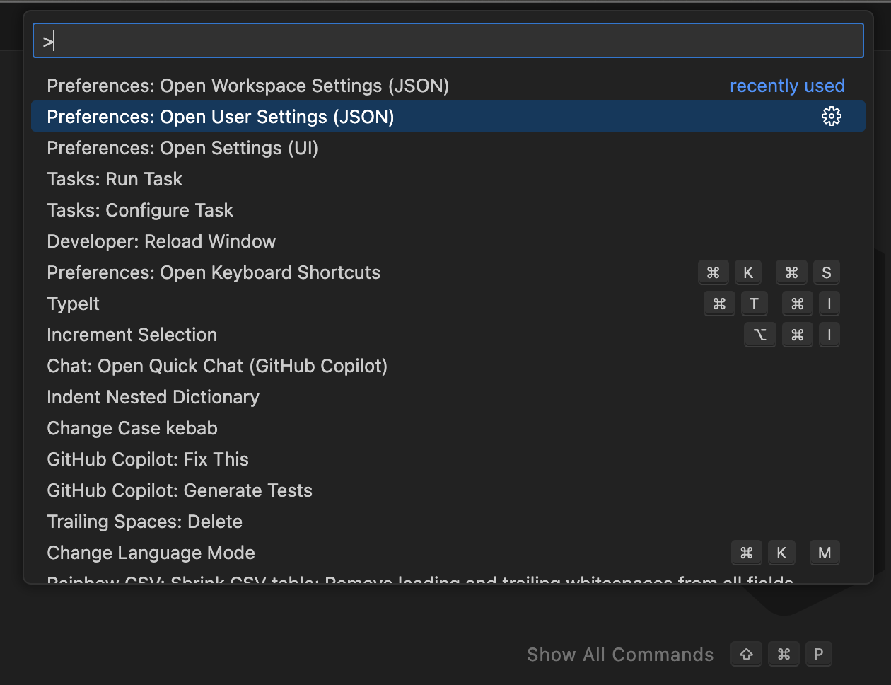
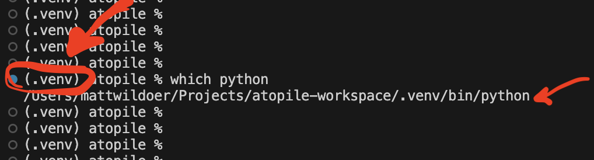
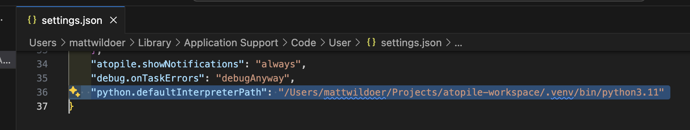

# atopile

This extension provides syntax highlighting, auto-completion and goto definition for atopile


## Installation

Instructions from the docs: https://atopile.io/getting-started/#vscode-extension-extension-store

There's a small amount of one-time configuration required to get type-hints from the extension.

1. Open up your settings. User settings are recommended so you only have to do this one, but if you manage multiple python environments, then you can use your workspace settings instead. If you do use workspace settings, you'll need to do this for each workspace you use atopile in.




2. Configure the python interpreter to use:

Replace `<path-to-.venv/bin/python>` with the actual path to the `python` binary in your venv.

You can find this by running `which python` while your venv is activated.



```json
"python.defaultInterpreterPath": "<path-to-.venv/bin/python>",
```

Like this!


